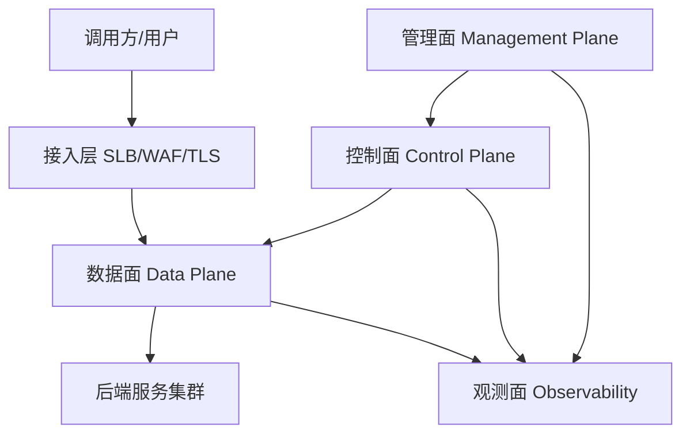
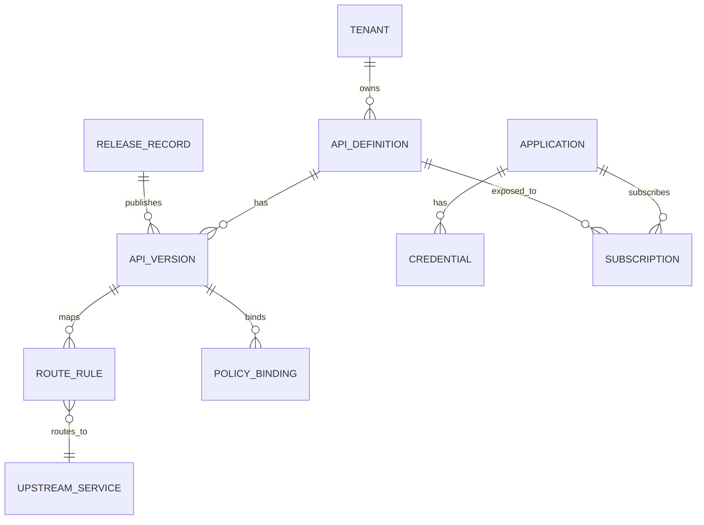
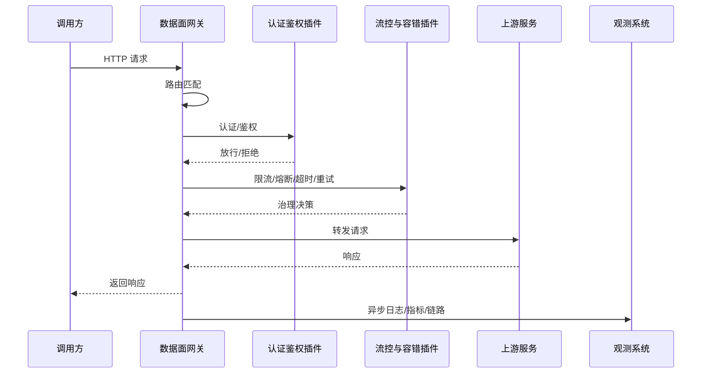
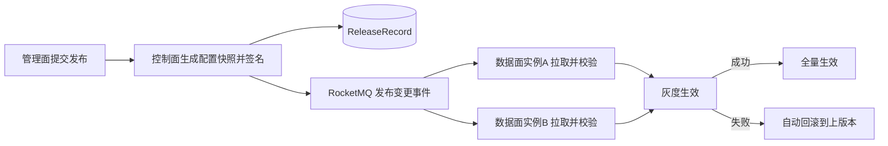
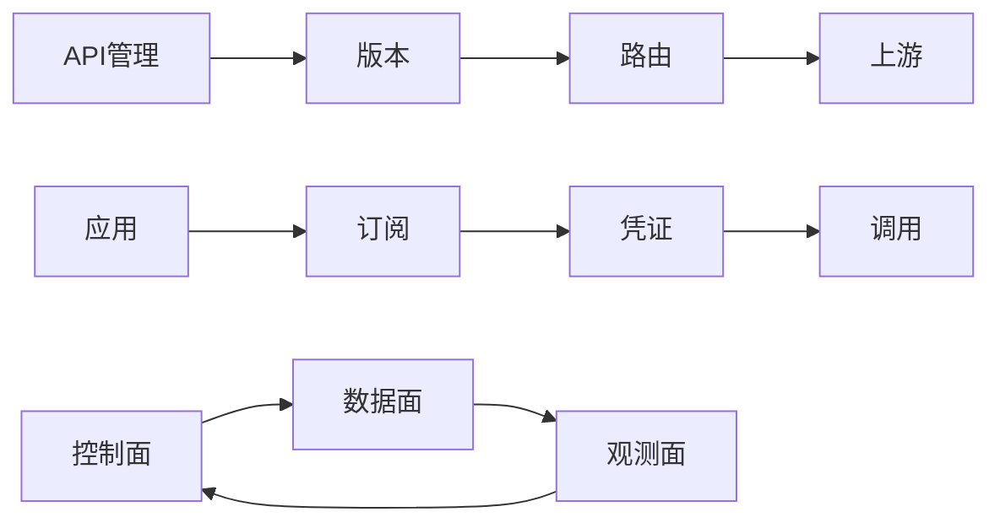
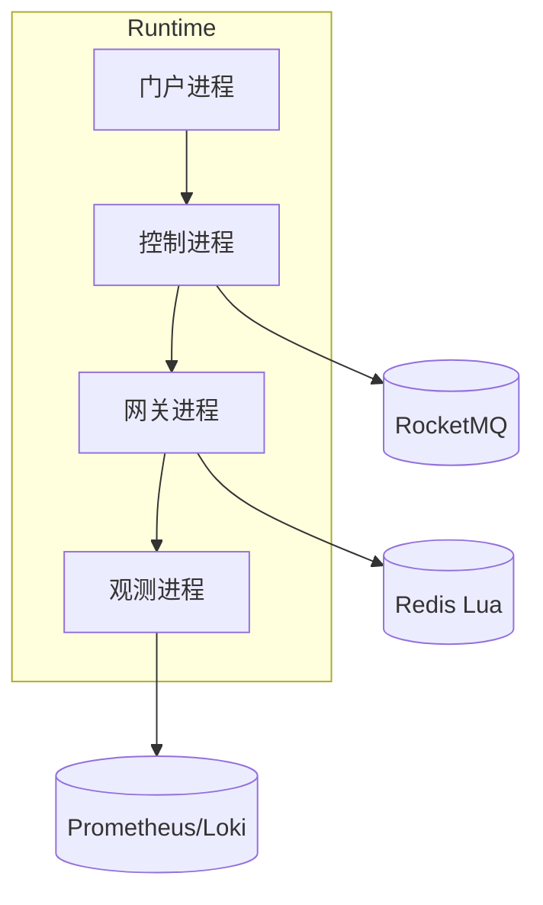
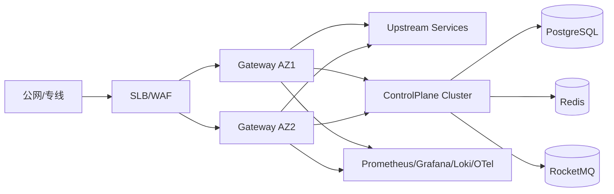
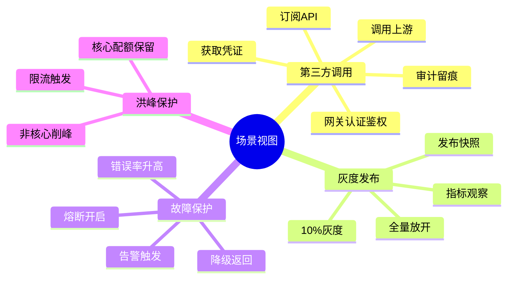

# Java API 网关平台详细设计文档（含 4+1 视图）

## 1. 目标与范围

### 1.1 目标
- 用 Java 构建企业级 API 网关与管理平台，解决统一入口、安全治理、流量控制、发布风险、可观测与多环境一致性问题。
- 支持多租户、多环境、多协议接入，具备高可用、可扩展、可审计能力。

### 1.2 范围
- 北向：HTTP/HTTPS、WebSocket（一期可先 HTTP/HTTPS）。
- 南向：HTTP/gRPC（一期先 HTTP）。
- 功能：路由、认证鉴权、限流熔断、发布灰度、门户订阅、监控审计。

## 2. 总体架构

### 2.1 分层
- 接入层：SLB/WAF/TLS 终止。
- 数据面（Data Plane）：实时请求处理。
- 控制面（Control Plane）：配置管理与下发。
- 管理面（Management Plane）：控制台、门户、开放管理 API。
- 观测面（Observability Plane）：指标、日志、链路、告警。

### 2.2 Java 技术栈
- 网关：Spring Cloud Gateway + Reactor Netty。
- 控制面：Spring Boot + Spring MVC。
- 服务治理：Spring Cloud LoadBalancer / Nacos / Consul。
- 鉴权：Spring Security + OAuth2 Resource Server + JWT。
- 缓存：Redis。
- 数据库：PostgreSQL（或 MySQL）。
- 消息总线：RocketMQ（配置变更事件）。
- 可观测：Micrometer + Prometheus + Grafana + OpenTelemetry。

## 3. 核心模块设计

### 3.1 数据面模块（gateway-dataplane）
- `RouteMatcher`：按 Host/Path/Method/Header 匹配路由。
- `PluginChain`：过滤器链，顺序执行认证、鉴权、限流、改写、审计。
- `UpstreamSelector`：负载均衡与健康实例选择。
- `ResilienceProcessor`：超时、重试、熔断、降级。
- `ConfigSnapshotCache`：本地快照缓存，支持热更新。

### 3.2 控制面模块（gateway-controlplane）
- `ApiService`：API 定义、版本管理。
- `RouteService`：路由规则与上游绑定。
- `PolicyService`：认证、限流、熔断等策略模板与实例化。
- `ReleaseService`：发布单、灰度、回滚。
- `ConfigPublisher`：配置快照生成、签名、下发事件。

### 3.3 管理面模块（api-management / portal）
- `AppService`：应用注册、凭证发放。
- `SubscriptionService`：API 订阅、审批流。
- `CredentialService`：Key/Secret、JWT Client、证书轮换。
- `AuditService`：管理操作审计。

### 3.4 观测模块（observability-service）
- `MetricsCollector`：网关指标采集。
- `LogPipeline`：访问日志与审计日志汇聚。
- `TraceBridge`：TraceID 透传与链路打点。
- `AlertRuleEngine`：阈值告警。

## 4. 关键数据模型

### 4.1 领域实体
- `Tenant`：租户。
- `Environment`：环境（dev/test/prod）。
- `ApiDefinition`：API 定义。
- `ApiVersion`：API 版本。
- `RouteRule`：路由规则。
- `UpstreamService`：后端服务。
- `PolicyBinding`：策略绑定关系。
- `Application`：调用方应用。
- `Credential`：访问凭证。
- `Subscription`：订阅关系。
- `ReleaseRecord`：发布记录。
- `AccessLog`、`AuditLog`、`MetricPoint`：观测数据。

### 4.2 表设计（核心）
- `t_api_definition(id, tenant_id, name, protocol, status, created_at, updated_at)`
- `t_api_version(id, api_id, version, openapi_doc, status, published_at)`
- `t_route_rule(id, api_version_id, host, path, method, priority, upstream_id)`
- `t_policy_binding(id, target_type, target_id, policy_type, policy_json, enabled)`
- `t_application(id, tenant_id, app_name, owner, status)`
- `t_credential(id, app_id, type, key_id, secret_hash, public_key, expire_at, status)`
- `t_subscription(id, app_id, api_id, plan_id, status, approved_by, approved_at)`
- `t_release_record(id, env, release_no, snapshot_hash, status, operator, created_at)`

## 5. 核心流程设计

### 5.1 请求处理流程（数据面）
1. 接收请求，生成 `requestId/traceId`。
2. 执行 `RouteMatcher` 匹配目标 API 与版本。
3. 执行认证插件（API Key/JWT/OAuth2/mTLS）。
4. 执行鉴权插件（RBAC/Scope/租户校验）。
5. 执行流控插件（QPS/并发/配额）。
6. 执行容错处理（超时/重试/熔断/降级）。
7. 转发到 `UpstreamService` 实例并回写响应。
8. 异步上报日志、指标、链路数据。

### 5.2 配置发布流程（控制面）
1. 管理面提交发布申请。
2. 控制面生成配置快照（路由+策略+上游）并签名。
3. 持久化 `ReleaseRecord`。
4. 通过 RocketMQ 发布配置变更事件。
5. 数据面实例拉取并校验快照签名。
6. 分批生效（灰度比例），失败自动回滚到上个快照。

### 5.3 凭证发放流程（管理面）
1. 应用发起 API 订阅。
2. 审批通过后生成凭证（Key/Secret 或 OAuth Client）。
3. 凭证加密存储，Secret 仅一次明文回显。
4. 数据面按缓存+数据库方式校验凭证有效性。

## 6. 插件体系设计

### 6.1 插件接口
- `GatewayPlugin`：
  - `String name()`
  - `int order()`
  - `Mono<Void> apply(ServerWebExchange exchange, PluginContext context, PluginChain chain)`

### 6.2 内置插件
- `AuthPlugin`：认证。
- `AclPlugin`：IP 白名单/黑名单。
- `RateLimitPlugin`：限流。
- `QuotaPlugin`：配额。
- `TransformPlugin`：请求/响应改写。
- `AuditPlugin`：审计。
- `CanaryPlugin`：灰度路由。

### 6.3 执行顺序
- `PreRoute`：认证、鉴权、限流。
- `PreUpstream`：改写、灰度。
- `PostResponse`：审计、指标上报。

## 7. 安全设计

### 7.1 认证与鉴权
- 支持 API Key、JWT、OAuth2 Client Credentials、mTLS。
- JWT 校验 `iss/aud/exp/scope`，并映射到策略引擎。
- 统一鉴权模型：`Subject(App/User)` + `Resource(API)` + `Action(Invoke)`。

### 7.2 密钥管理
- Secret 仅存储哈希，不落明文。
- 支持密钥轮换与失效策略。
- 签名请求校验时间窗与 nonce，防重放。

### 7.3 传输安全
- 全链路 TLS，内部可选 mTLS。
- 管理 API 独立域名与网络隔离。

## 8. 高可用与性能设计

### 8.1 高可用
- 数据面无状态多副本，跨可用区部署。
- 控制面主从或多副本部署。
- Redis/RocketMQ/DB 使用高可用集群。

### 8.2 性能
- Reactor 非阻塞链路，避免阻塞 IO。
- 热路径配置本地缓存，Redis 仅做兜底。
- 限流计数使用 Redis Lua 保证原子性。
- 日志异步批量写入，避免主链路抖动。

## 9. 可观测与运维

### 9.1 指标
- 请求量、成功率、错误率、P95/P99 延迟、限流命中率、熔断打开次数。

### 9.2 日志
- 访问日志：请求基础信息、响应码、耗时、调用方。
- 审计日志：发布、回滚、策略变更、凭证操作。

### 9.3 链路
- 统一透传 `traceparent` / `X-Request-Id`。

### 9.4 运维
- 蓝绿/灰度发布。
- 配置版本对比与一键回滚。
- SLO 告警联动自动回退。

## 10. 4+1 视图

### 10.1 逻辑视图（Logical View）
- 子域：API 管理、流量治理、安全、发布、观测、门户。
- 核心关系：`API -> 版本 -> 路由 -> 上游`，`应用 -> 订阅 -> 凭证 -> 调用`。
- 控制面管理规则，数据面执行规则，观测面反馈闭环。

### 10.2 开发视图（Development View）
- 仓库结构建议：
  - `gateway-dataplane`
  - `gateway-controlplane`
  - `api-management`
  - `portal-service`
  - `observability-service`
  - `common-starter`（鉴权、异常码、日志、SDK）
- 分层：`controller` / `application` / `domain` / `infrastructure`。
- 统一 BOM 与依赖版本，统一错误码与返回模型。

### 10.3 进程视图（Process View）
- 进程角色：
  - 网关进程：处理在线请求。
  - 控制进程：处理配置与发布。
  - 门户进程：处理订阅与审批。
  - 观测进程：处理日志、指标、告警。
- 关键并发点：
  - 配置下发与热更新并发控制（版本号 CAS）。
  - 限流计数原子更新（Redis Lua）。
  - 日志上报异步队列削峰。

### 10.4 物理视图（Physical View）
- 生产部署：
  - `SLB/WAF -> Gateway Cluster -> Upstream Services`
  - `ControlPlane Cluster -> DB/Redis/RocketMQ`
  - `Observability -> Prometheus/Grafana/Loki/OTel`
- 多环境隔离：独立命名空间 + 独立配置前缀 + 独立凭证域。
- 多地域策略：同城双活或异地主备，按业务等级选择。

### 10.5 场景视图（Scenarios）
- 场景 A：第三方应用调用开放 API
  - 订阅 API -> 获取凭证 -> 网关认证鉴权 -> 调用上游 -> 记录审计。
- 场景 B：灰度发布新版本
  - 发布快照 -> 10% 灰度 -> 监控稳定 -> 全量放开。
- 场景 C：后端故障保护
  - 错误率升高 -> 熔断开启 -> 返回降级响应 -> 告警触发。
- 场景 D：流量洪峰保护
  - 限流触发 -> 核心租户保留配额 -> 非核心流量削峰。

## 11. 实施计划

### 11.1 一期（MVP）
- 路由、认证（API Key/JWT）、基础限流、日志指标、控制台发布。

### 11.2 二期
- 灰度发布、熔断降级、门户订阅、审计、配额。

### 11.3 三期
- 多地域容灾、计费、插件市场、全协议支持。
