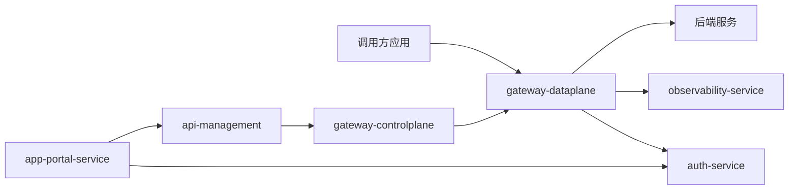

# MVP 微服务设计

## 1. 服务拆分

### 1.1 gateway-dataplane（网关数据面）
- 职责：统一入口流量接入与实时请求处理。
- 核心能力：
  - 路由匹配（Host/Path/Method/Header）
  - 认证鉴权插件执行（JWT/API Key）
  - 限流与基础熔断
  - 上游转发与负载均衡
  - 访问日志与指标上报
- 依赖：
  - `gateway-controlplane`（拉取配置快照）
  - `auth-service`（令牌校验公钥/策略结果）
  - `observability-service`（上报日志指标）

### 1.2 gateway-controlplane（网关控制面）
- 职责：管理并下发网关运行配置。
- 核心能力：
  - 路由、上游、策略配置管理
  - 配置快照生成与版本化
  - 发布、灰度、回滚
  - 配置变更通知（事件或轮询）
- 依赖：
  - `api-management`（读取 API 版本与发布状态）
  - 元数据存储（MySQL/PostgreSQL）
  - 缓存/消息组件（Redis/RocketMQ，可按 MVP 简化）

### 1.3 api-management（API 管理）
- 职责：API 生命周期管理。
- 核心能力：
  - API 定义管理（OpenAPI 导入）
  - API 版本管理
  - 发布记录管理
  - 与路由策略绑定
- 依赖：
  - `gateway-controlplane`（发布时驱动配置生成）
  - 元数据数据库

### 1.4 auth-service（认证鉴权中心）
- 职责：统一身份认证与权限判定。
- 核心能力：
  - 应用凭证管理（Client/API Key）
  - JWT 签发与校验
  - Scope/角色权限判定
  - 密钥轮换与吊销
- 依赖：
  - 凭证库与密钥管理（MVP 可先数据库 + 加密字段）

### 1.5 app-portal-service（应用与订阅）
- 职责：调用方应用接入与订阅流程。
- 核心能力：
  - 应用注册
  - API 订阅申请/审批
  - 凭证申请与查看
  - 调用统计查询（MVP 可读聚合数据）
- 依赖：
  - `api-management`（可订阅 API）
  - `auth-service`（发放凭证）

### 1.6 observability-service（观测服务）
- 职责：统一观测数据接入与查询。
- 核心能力：
  - 访问日志聚合
  - 审计日志聚合
  - 核心指标聚合（QPS/错误率/延迟）
  - 基础告警（阈值）
- 依赖：
  - 存储（MVP 可先 ES/ClickHouse/时序库三选一简化）

## 2. 服务边界（按 SOLID）

- `gateway-dataplane`：单一职责处理流量路径，不承载管理逻辑。
- `gateway-controlplane`：单一职责处理配置治理，不处理实时转发。
- `api-management`：单一职责管理 API 资产与版本。
- `auth-service`：单一职责处理身份与权限策略。
- `app-portal-service`：单一职责处理应用接入与订阅协作。
- `observability-service`：单一职责处理日志/指标/审计闭环。

## 3. MVP 交互关系

## 4. MVP 最小功能基线

- `gateway-dataplane`：路由、JWT/API Key 认证、基础限流、日志上报。
- `gateway-controlplane`：路由配置管理、配置下发、版本回滚。
- `api-management`：API 定义、版本、发布记录。
- `auth-service`：凭证管理、JWT 签发/校验、基础权限模型。
- `app-portal-service`：应用注册、订阅审批、凭证申请。
- `observability-service`：访问日志、审计日志、核心指标查询。

## 5. MVP 发布顺序

1. `auth-service` + `gateway-dataplane`（先打通认证与转发主链路）
2. `gateway-controlplane` + `api-management`（补齐配置治理与发布）
3. `app-portal-service`（补齐接入与订阅流程）
4. `observability-service`（补齐运营与运维可观测）
