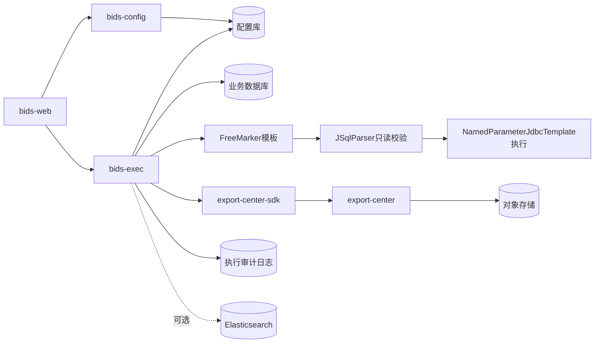
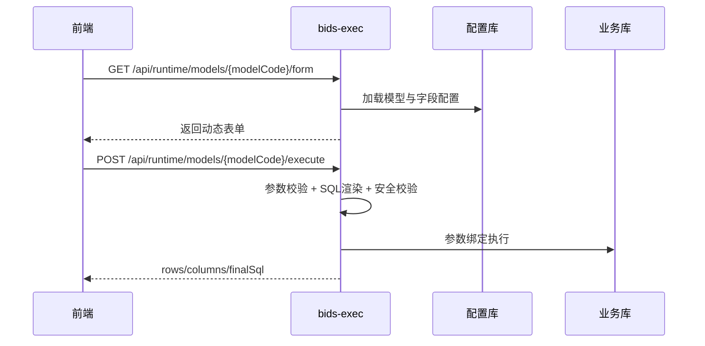
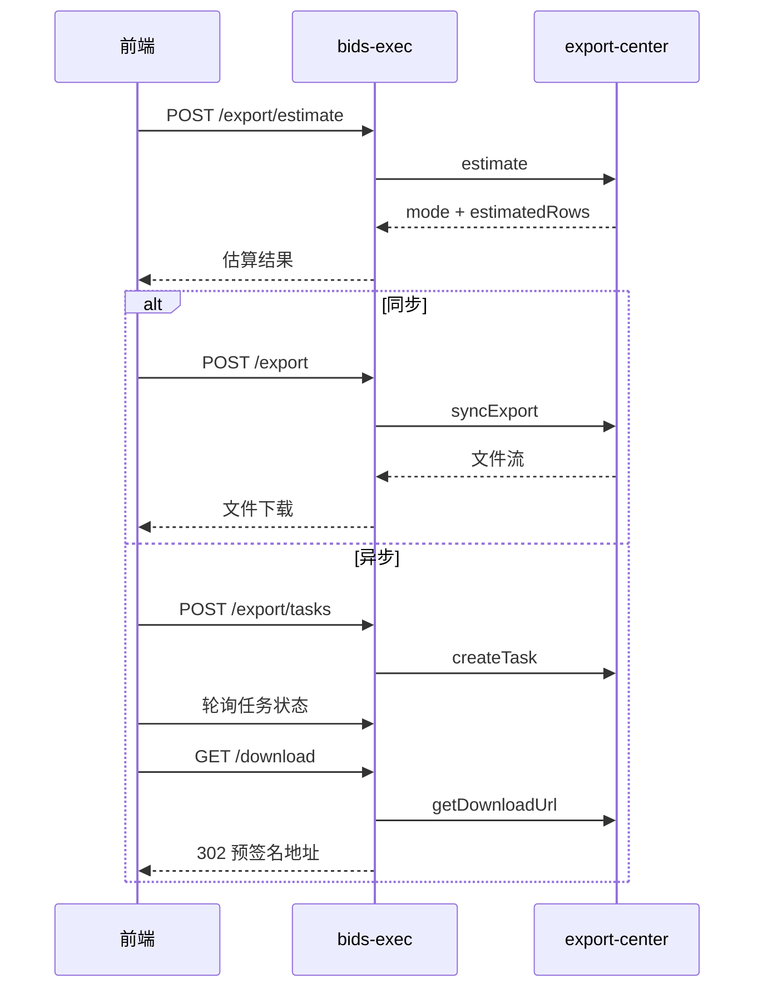

# BIDS系统设计文档

## 1. 文档定位

本文档用于统一 BIDS 的架构设计口径，兼顾：

- 架构评审：明确组件边界、主链路、风险与演进方向。
- 研发落地：给出模块职责、接口分层、实施路线与优先级。

## 2. 规划引用

本设计遵循平台级规划文档：

- `docs/Yeswater企业数字化系统规划.md`

在该规划下，BIDS 作为业务域组件，负责业务规则、配置、执行与数据服务编排，并通过标准契约对接平台能力（APIG、IAM、导出中心、EDM）。

## 3. 设计目标与范围

### 3.1 目标

- 建立可配置、可发布、可执行、可审计的数据服务能力。
- 保持现有主链路稳定，逐步补齐治理与平台化能力。
- 导出能力平台化：BIDS 保留业务语义，导出执行统一交由 `export-center`。

### 3.2 范围

- 控制面：`bids-config`
- 执行面：`bids-exec`
- 前端：`bids-web`
- 平台对接：`apig`、`iam`、`export-center`、`edm`

## 4. 总体架构



## 5. 核心链路

### 5.1 查询链路



### 5.2 导出链路（平台化后）



## 6. 模块职责

### 6.1 `bids-config`

- 维护数据源、SQL 模型、表单字段、返回列、模型权限。
- 提供模型校验、发布、下线能力。

### 6.2 `bids-exec`

- 负责运行态接口、参数白名单、类型校验、SQL 渲染与只读校验。
- 执行查询并记录审计日志。
- 作为导出编排入口，调用 `export-center-sdk`，不直接承担文件生成与对象存储逻辑。

### 6.3 `bids-web`

- 渲染动态表单、展示查询结果、展示最终 SQL。
- 提供导出入口、任务轮询、下载触发。

### 6.4 平台组件（外部依赖）

- `iam`：统一身份与权限判定基线。
- `apig`：统一接入与流量治理。
- `export-center`：统一导出任务执行、文件分发、导出审计。
- `edm`：文档归档与资产管理（导出结果可回写归档）。

## 7. 关键接口（对外）

```text
GET  /api/runtime/models/{modelCode}/form
POST /api/runtime/models/{modelCode}/execute
POST /api/runtime/models/{modelCode}/export/estimate
POST /api/runtime/models/{modelCode}/export
POST /api/runtime/models/{modelCode}/export/tasks
GET  /api/runtime/export/tasks/{taskId}
GET  /api/runtime/export/tasks/{taskId}/download
GET  /api/runtime/logs/{executeId}
```

## 8. 对标与演进要点

结合华为云与互联网大厂公开实践，BIDS 的演进重点为：

- 模型版本治理：版本对比、灰度发布、回滚。
- 权限治理增强：RBAC 向 ABAC 扩展。
- 可观测性增强：统一指标、链路追踪、慢查询治理。
- 导出治理平台化：任务中心化、配额与并发控制、统一审计。

## 9. 分期实施路线


- 阶段1：模型版本治理、限流配额、观测基线。
- 阶段2：ABAC、任务治理、资产化能力。
- 阶段3：SQL 成本治理、多租户隔离、跨域协同优化。

## 10. 风险与控制

- 权限策略复杂导致误拒绝：先仿真后生效。
- 导出任务高峰影响查询：导出中心并发隔离与配额控制。
- 变更发布风险：版本化发布 + 快速回滚。

## 11. 参考文档

- `docs/Yeswater企业数字化系统规划.md`
- `bids/docs/导出功能需求设计.md`
- `export-center/docs/导出中心系统设计文档.md`
