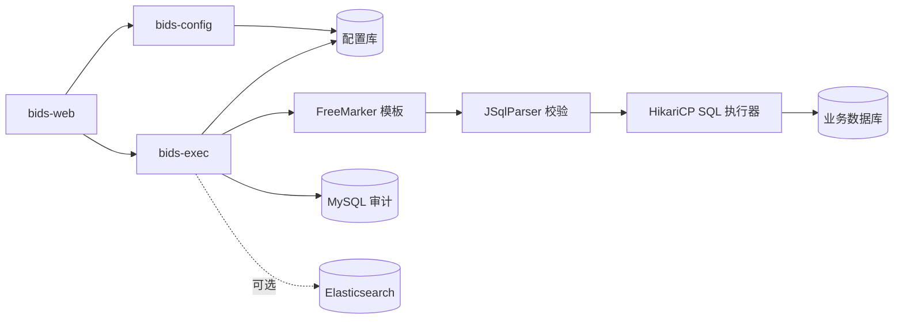
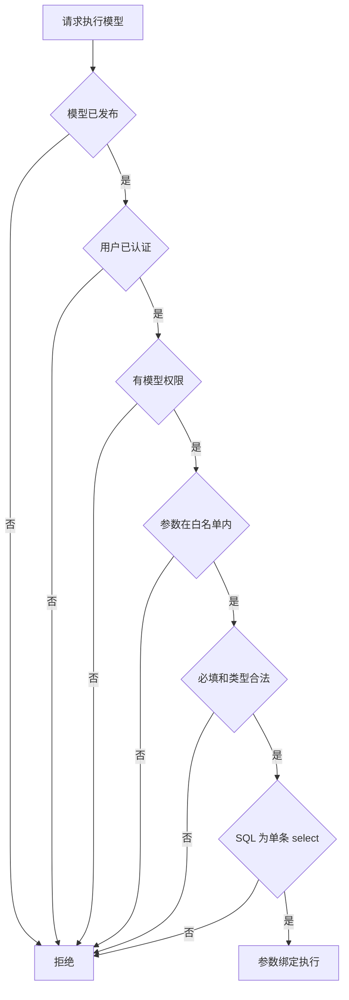
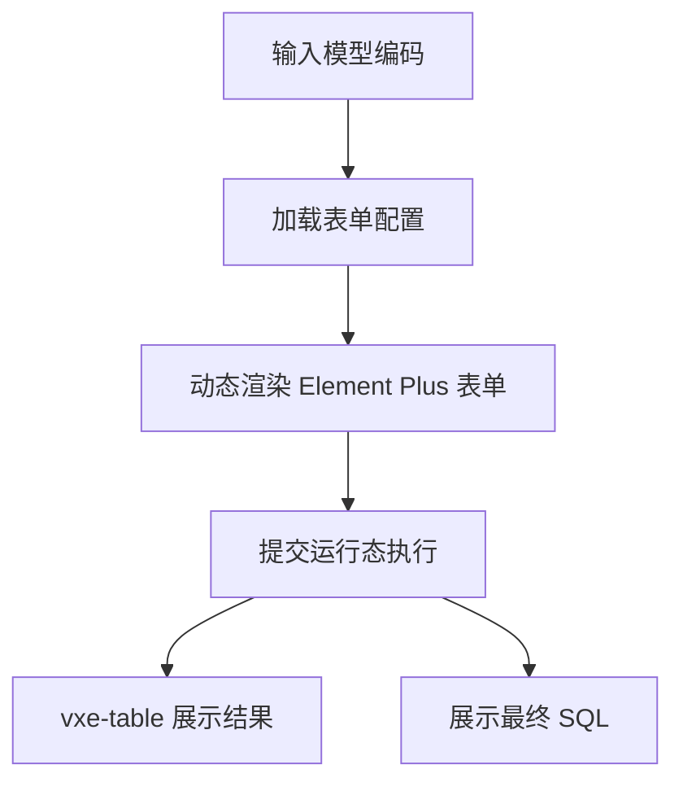

# BIDS 服务设计文档

## 目标

构建一个用于封装和配置复杂 SQL 的平台，用户在配置态维护 SQL 模型、表单字段、返回列和权限；前台页面根据配置渲染表单，请求运行态服务组装参数、执行 SQL，并以表格展示结果和最终执行 SQL。

## 技术栈

- 后端：Spring Boot，服务拆分为 `bids-config` 与 `bids-exec`
- SQL 模板：FreeMarker
- SQL 解析：JSqlParser
- 权限：Spring Security
- 数据库连接池：HikariCP
- 前端：Vue3 + Element Plus
- 表格：vxe-table
- 配置库：MySQL / PostgreSQL
- 审计日志：MySQL，Elasticsearch 可选

## 总体架构




## 配置态能力

`bids-config` 按 DDD 分层组织，包路径为 `com.yeswater.bids.config`：

```text
interfaces/rest        配置态 HTTP 接口
interfaces/dto         配置态入参和出参
application            配置态应用服务
domain/model           配置态领域模型
infrastructure         持久化、安全和异常处理
```

配置态负责维护：

- 数据源
- SQL 模型
- 表单字段
- 返回列
- 模型权限
- 发布、下线和 SQL 校验

主要接口：

```text
POST /api/config/datasources
POST /api/config/models
PUT  /api/config/models/{id}
POST /api/config/models/{id}/validate
POST /api/config/models/{id}/publish
POST /api/config/models/{id}/offline
GET  /api/config/models/{id}
```

## 运行态能力

`bids-exec` 按 DDD 分层组织，包路径为 `com.yeswater.bids.exec`：

```text
interfaces/rest        运行态 HTTP 接口
interfaces/dto         运行态入参和出参
application            运行态应用服务
domain/model           运行态领域模型
infrastructure         持久化、数据源、安全、审计和异常处理
```

运行态负责：

- 读取已发布模型
- 渲染动态表单
- 参数白名单校验
- 用户权限校验
- FreeMarker 渲染 SQL
- JSqlParser 校验只读 SQL
- 使用 NamedParameterJdbcTemplate 参数绑定执行 SQL
- 返回表格列、数据、最终 SQL
- 写入执行审计日志

主要接口：

```text
GET  /api/runtime/models/{modelCode}/form
POST /api/runtime/models/{modelCode}/execute
GET  /api/runtime/logs/{executeId}
```

## SQL 模板规则

SQL 模板使用 FreeMarker，只允许通过命名参数绑定传值。

```sql
select
  order_id,
  user_name,
  amount,
  create_time
from t_order
where 1 = 1
<#if userName?? && userName?has_content>
  and user_name like concat('%', :userName, '%')
</#if>
<#if startTime?? && startTime?has_content>
  and create_time >= :startTime
</#if>
order by create_time desc
```

禁止在模板中直接拼接用户输入值。运行态只执行 JSqlParser 识别为单条 `select` 的 SQL，并自动增加最大行数限制。

## 安全控制




## 数据模型

```text
bids_datasource        数据源配置
bids_sql_model         SQL 模型主表
bids_form_field        表单字段配置
bids_result_column     返回列配置
bids_model_permission  模型权限
bids_execute_log       执行审计日志
```

## 前端页面




## 最小可用范围

- 配置数据源
- 配置 SQL 模型、表单字段、返回列、权限
- 校验、发布、下线模型
- 前台加载模型表单
- 运行模型并展示表格
- 展示最终 SQL
- 记录执行日志

