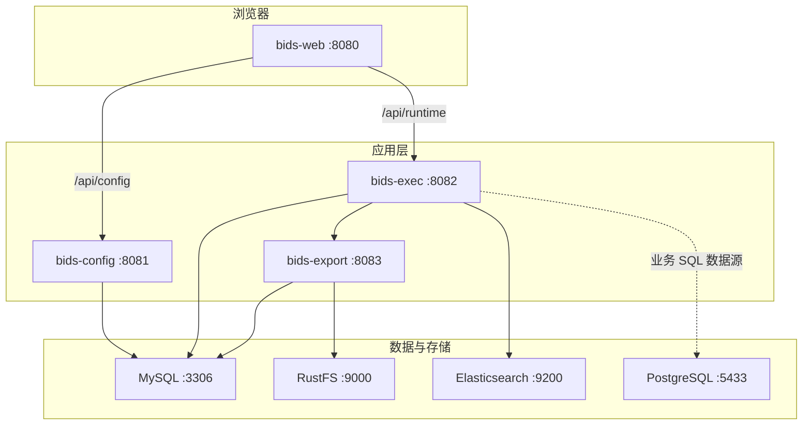

# BIDS 构建与运行环境

本文档说明本仓库开发与部署所需的软件环境、端口、配置方式，以及**复用本机已有环境**或**从零安装**的操作指引。

---

## 1. 概述

BIDS 采用多服务架构：配置中心（`bids-config`）、运行态（`bids-exec`）、导出服务（`bids-export`）、前端（`bids-web`），依赖 MySQL（元数据）、PostgreSQL（业务演示库）、Elasticsearch（审计，Docker 环境默认开启）、RustFS（S3 兼容对象存储，导出异步用）。

### 推荐方式

| 方式 | 适用场景 | 说明 |
|------|----------|------|
| **Docker Compose 一键** | 日常开发、联调、演示 | 构建与运行均在容器内完成，与仓库 Dockerfile 一致，**优先推荐** |
| **本地混合** | 只调试某一后端/前端 | 中间件用 Compose 起，Java/Node 在宿主机运行并改环境变量指向本机端口 |
| **全本地** | 已有完整中间件 | 需自行保证版本与端口一致，配置见第 4 节 |



---

## 2. 环境清单

### 2.1 运行时组件（Compose）

| 组件 | 镜像/构建 | 版本（默认） | 用途 | 宿主机端口 |
|------|-----------|--------------|------|------------|
| **bids-web** | `docker/bids-web/Dockerfile` | Node 20 + Nginx Alpine | 前端静态资源 + 反向代理 | **8080** → 80 |
| **bids-config** | `docker/bids-config/Dockerfile` | JDK 21（Temurin JRE） | SQL 模型/数据源配置 API | **8081** |
| **bids-exec** | `docker/bids-exec/Dockerfile` | JDK 21 | 查询执行、导出编排 | **8082** |
| **bids-export** | `docker/bids-export/Dockerfile` | JDK 21 | Excel 导出引擎 | **8083** |
| **mysql** | `docker/mysql/Dockerfile` | MySQL **8.0** | 平台元数据库 `bids` | **3306** |
| **postgres** | 官方镜像 | **16** Alpine | 财经演示库 `bids_fin_demo` | **5433** → 5432 |
| **elasticsearch** | 官方镜像 | **8.15.3** | 执行审计（docker profile 开启） | **9200** |
| **rustfs** | `rustfs/rustfs:latest` | latest | 导出文件对象存储（S3 兼容） | **9000**、**9001** |

### 2.2 构建工具链（镜像内 / 本地可选）

| 工具 | 版本要求 | 用途 |
|------|----------|------|
| **JDK** | **21**（`java.version`） | 编译与运行 Spring Boot **3.5.3** 后端 |
| **Maven** | **3.9+**（镜像：`maven:3.9.9-eclipse-temurin-21`） | 后端多模块构建 |
| **Node.js** | **20.x**（推荐 ≥ 20.19；Vite 8 依赖） | 前端 `npm ci` / `npm run dev` |
| **Docker** | 20.10+，Compose V2 | 一键编排 |
| **Docker Compose** | v2 | `docker compose` 命令 |

### 2.3 后端模块（`backend/pom.xml`）

| 模块 | 说明 |
|------|------|
| `bids-sql-dialect` | SQL 方言 |
| `bids-config` | 配置服务 |
| `bids-exec` | 运行态 |
| `bids-export-api` / `bids-export-sdk` / `bids-export` | 导出 API、SDK、服务 |

---

## 3. 前置条件检查

在仓库根目录执行：

```bash
docker version          # 客户端与服务端均可用
docker compose version  # Compose V2
```

### 端口占用（宿主机）

确认以下端口未被占用：`8080`、`8081`、`8082`、`8083`、`3306`、`5433`、`9200`、`9000`、`9001`。

```bash
# macOS
lsof -i :8080 -i :3306 -i :5433 -i :9200
```

### 资源建议

| 项目 | 建议 |
|------|------|
| 磁盘 | Docker 数据卷 + 镜像，预留 **≥ 10 GB** |
| 内存 | 全栈启动时建议 **≥ 8 GB** 分配给 Docker（Elasticsearch 占 512MB 级堆） |
| macOS | 使用 `docker-compose.macos.yml` 合并配置以降低 ES/JVM 内存 |

---

## 4. 使用本机已有环境

### 4.1 已有 Docker（推荐复用）

若本机已安装 Docker Desktop / Docker Engine，**无需**再装 JDK/Maven/Node 即可构建运行：

```bash
cp .env.example .env
# 按需编辑 REGISTRY_PREFIX 等，见第 6 节

# macOS
docker compose -f docker-compose.yml -f docker-compose.macos.yml build --pull=false
docker compose -f docker-compose.yml -f docker-compose.macos.yml up -d

# Linux
docker compose -f docker-compose.yml -f docker-compose.linux.yml up -d --build

# Windows
docker compose -f docker-compose.yml -f docker-compose.windows.yml up -d --build
```

仅重建应用层（常用）：

```bash
./scripts/compose-up-web.sh
# 等价：build mysql bids-config bids-export bids-exec bids-web && up bids-web
```

### 4.2 已有 JDK 21 + Maven（本地编译后端）

```bash
cd backend
mvn -pl bids-config -am package -DskipTests      # 配置服务
mvn -pl bids-exec -am package -DskipTests        # 运行态（含 export-sdk）
mvn -pl bids-export -am package -DskipTests        # 导出服务

# 运行示例（需 MySQL 等已就绪）
export SPRING_PROFILES_ACTIVE=default
export BIDS_CONFIG_DB_URL='jdbc:mysql://127.0.0.1:3306/bids?useUnicode=true&characterEncoding=utf8&useSSL=false&allowPublicKeyRetrieval=true&serverTimezone=UTC'
export BIDS_CONFIG_DB_USERNAME=bids
export BIDS_CONFIG_DB_PASSWORD=bids
java -jar bids-config/target/bids-config-0.0.1-SNAPSHOT.jar

# 另开终端：exec / export，并设置 BIDS_EXPORT_CLIENT_BASE_URL=http://127.0.0.1:8083
```

中间件仍建议用 Compose 只起依赖：

```bash
docker compose up -d mysql postgres elasticsearch rustfs
```

### 4.3 已有 Node.js 20（本地前端开发）

```bash
cd frontend
npm ci
npm run dev   # 默认 http://localhost:5173，代理到 8081/8082
```

`frontend/vite.config.js` 默认代理：

- `/api/config` → `http://127.0.0.1:8081`
- `/api/runtime` → `http://127.0.0.1:8082`

需同时在本机或 Docker 中启动 `bids-config`、`bids-exec`（及导出功能所需的 `bids-export`）。

### 4.4 已有 MySQL / PostgreSQL

| 服务 | 对接方式 |
|------|----------|
| **MySQL 8** | 创建库 `bids`、用户 `bids`/`bids`（或与 `.env` 一致）；JDBC 指向 `127.0.0.1:3306`；执行 `docker/mysql/init/*.sql` 初始化表结构（首次） |
| **PostgreSQL 16** | 创建库 `bids_fin_demo`；JDBC 示例：`jdbc:postgresql://127.0.0.1:5432/bids_fin_demo`（Compose 映射为 **5433**）；种子数据见 `docker/pgsql/init/` |

在管理界面新建数据源时，`jdbcUrl` 需与运行位置一致：

- 应用在 **Docker 内** 访问 PG：`jdbc:postgresql://postgres:5432/bids_fin_demo`
- 应用在 **宿主机** 访问 Compose 中的 PG：`jdbc:postgresql://127.0.0.1:5433/bids_fin_demo`

### 4.5 环境变量对照（本地跑 Java）

| 变量 | 默认值 / 说明 |
|------|----------------|
| `BIDS_CONFIG_DB_URL` | MySQL 连接串 |
| `BIDS_CONFIG_DB_USERNAME` / `BIDS_CONFIG_DB_PASSWORD` | 元数据库账号 |
| `BIDS_EXPORT_CLIENT_BASE_URL` | exec → export，默认 `http://localhost:8083` |
| `BIDS_EXPORT_INTERNAL_TOKEN` | 与 export 服务一致，默认 `change-me` |
| `BIDS_EXPORT_DB_URL` | export 任务表所在 MySQL（通常与 config 相同） |
| `BIDS_EXPORT_RUSTFS_ENDPOINT` | 默认 `http://localhost:9000` |
| `BIDS_EXPORT_STORAGE_TYPE` | Docker 为 `s3`；本地可 `local` |
| `SPRING_ELASTICSEARCH_URIS` | 默认 `http://localhost:9200`（docker profile 下 exec 开启审计） |
| `BIDS_ADMIN_USERNAME` / `BIDS_ADMIN_PASSWORD` | HTTP Basic，默认 **admin** / **admin** |

---

## 5. 无本地环境时的安装指引

### 5.1 macOS（主）

1. **Docker Desktop**  
   - 下载：https://docs.docker.com/desktop/setup/install/mac-install/  
   - 安装后分配足够 CPU/内存（建议 ≥ 4 核、8GB）。

2. **（可选）JDK 21** — 仅本地跑 Java 时需要  
   ```bash
   brew install openjdk@21
   # 或 SDKMAN: sdk install java 21.0.2-tem
   java -version   # 应显示 21
   ```

3. **（可选）Maven 3.9+**  
   ```bash
   brew install maven
   mvn -version
   ```

4. **（可选）Node.js 20** — 仅本地前端开发  
   ```bash
   brew install node@20
   # 或 nvm: nvm install 20 && nvm use 20
   node -v   # v20.x
   ```

5. **克隆仓库并配置**  
   ```bash
   git clone <仓库地址> bids && cd bids
   cp .env.example .env
   ```

### 5.2 Linux（简要）

- 安装 [Docker Engine](https://docs.docker.com/engine/install/) + Compose 插件。  
- 使用合并文件：`docker compose -f docker-compose.yml -f docker-compose.linux.yml up -d --build`（提供 `host.docker.internal`）。  
- JDK/Maven/Node 可用发行版包管理器或 SDKMAN/nvm，版本要求同第 2 节。

### 5.3 国内镜像加速

拉取镜像失败时，在 `.env` 中设置 `REGISTRY_PREFIX`（末尾带 `/`），例如：

```env
REGISTRY_PREFIX=docker.m.daocloud.io/library/
# 或
REGISTRY_PREFIX=registry.cn-hangzhou.aliyuncs.com/library/
```

构建时建议：`docker compose build --pull=false`（使用已有基镜像，减少拉取）。

**需与负责人确认**：`rustfs/rustfs:latest`、部分环境使用的 `public.ecr.aws/.../postgres` 镜像在贵司网络是否可访问；不可访问时需替换为内网镜像源并更新 `.env` 中 `POSTGRES_IMAGE` / `RUSTFS_IMAGE`。

---

## 6. `.env` 配置说明

复制模板：

```bash
cp .env.example .env
```

| 变量 | 默认值 | 说明 |
|------|--------|------|
| `REGISTRY_PREFIX` | 空 | 镜像仓库前缀，用于国内加速 |
| `MAVEN_BUILD_IMAGE` | `maven:3.9.9-eclipse-temurin-21` | 后端构建阶段镜像 |
| `JAVA_RUN_IMAGE` | `eclipse-temurin:21-jre-jammy` | 后端运行阶段 JRE |
| `NODE_IMAGE` | `node:20-alpine` | 前端构建 |
| `NGINX_IMAGE` | `nginx:alpine` | 前端运行 |
| `MYSQL_BASE_IMAGE` | `mysql:8.0` | MySQL 基镜像 |
| `POSTGRES_IMAGE` | `postgres:16-alpine` | PostgreSQL 镜像 |
| `ES_IMAGE` | `elasticsearch:8.15.3` | Elasticsearch |
| `RUSTFS_IMAGE` | `rustfs/rustfs:latest` | 对象存储 |
| `MYSQL_ROOT_PASSWORD` | `root`（compose 默认） | MySQL root 密码 |
| `BIDS_ADMIN_USERNAME` | `admin` | 平台登录用户名 |
| `BIDS_ADMIN_PASSWORD` | `admin` | 平台登录密码 |
| `BIDS_EXPORT_INTERNAL_TOKEN` | `change-me` | exec 与 export 内部鉴权，**生产务必修改** |
| `RUSTFS_ACCESS_KEY` / `RUSTFS_SECRET_KEY` | `rustfsadmin` | RustFS 访问密钥 |

> 勿将含真实密钥的 `.env` 提交到 Git；仓库已提供 `.env.example` 作为模板。

---

## 7. 构建与启动命令

### 7.1 全栈启动

```bash
# 通用（按需加 -f docker-compose.macos.yml 等）
docker compose --env-file .env build --pull=false
docker compose --env-file .env up -d
```

查看状态：

```bash
docker compose ps
docker compose logs -f bids-exec bids-export
```

### 7.2 按模块构建（Docker 内 Maven）

与各 `Dockerfile` 一致：

```bash
docker compose build bids-config    # mvn -pl bids-config -am package
docker compose build bids-exec      # mvn -pl bids-exec -am package
docker compose build bids-export    # mvn -pl bids-export -am package
docker compose build bids-web       # npm ci && npm run build
```

### 7.3 辅助脚本

| 脚本 | 作用 |
|------|------|
| `scripts/compose-up-web.sh` | 构建 mysql/config/export/exec/web 并启动 web |
| `scripts/e2e-pg-financial.sh` | PG 财经演示端到端（需 `docker-compose.macos.yml`） |
| `scripts/run-fin-holdings-exec-tests.sh` | 持仓查询执行测试 |

---

## 8. 访问地址与默认账号

| 入口 | URL |
|------|-----|
| **Web 控制台** | http://localhost:8080 |
| 配置 API | http://localhost:8081/api/config/ |
| 运行态 API | http://localhost:8082/api/runtime/ |
| 导出 API（内部） | http://localhost:8083/api/export/v1/ |
| Elasticsearch | http://localhost:9200 |
| RustFS | http://localhost:9000（控制台/API） |

| 账号类型 | 用户名 | 密码 | 说明 |
|----------|--------|------|------|
| 平台登录 | `admin` | `admin` | 由 `BIDS_ADMIN_*` 控制，Basic 认证 |
| MySQL 应用 | `bids` | `bids` | 元数据库 |
| MySQL root | `root` | `root`（默认） | 可用 `MYSQL_ROOT_PASSWORD` 覆盖 |
| PostgreSQL | `bids` | `bids` | 库名 `bids_fin_demo` |
| RustFS | `rustfsadmin` | `rustfsadmin` | 与 `RUSTFS_*` 环境变量一致 |

本地前端开发：http://localhost:5173（`npm run dev`）。

---

## 9. 常见问题

### Q1：构建时拉取镜像超时

- 配置 `.env` 中 `REGISTRY_PREFIX`。  
- 使用 `docker compose build --pull=false`。  
- 若仍失败，**需与负责人确认**内网镜像仓库地址与可用标签。

### Q2：端口已被占用

修改 `docker-compose.yml` 中对应 `ports` 映射，或停止占用进程；MySQL/ES 变更后需同步修改应用 JDBC / `SPRING_ELASTICSEARCH_URIS`。

### Q3：Elasticsearch 启动慢或 OOM

- macOS 使用 `docker-compose.macos.yml` 降低 `ES_JAVA_OPTS`。  
- 增大 Docker Desktop 内存上限。

### Q4：导出失败（临时目录 / Date 类型）

- 确保 `bids-export` 已用最新镜像重建。  
- 临时目录默认为 `${java.io.tmpdir}/bids-export`，容器内需可写。  
- 详见全局 debug 规则中的导出相关条目。

### Q5：只想起数据库、不起应用

```bash
docker compose up -d mysql postgres elasticsearch rustfs
```

### Q6：如何验证导出接口

```bash
curl -s -u admin:admin -X POST \
  'http://localhost:8082/api/runtime/models/<模型编码>/export/estimate' \
  -H 'Content-Type: application/json' \
  -d '{"parameters":{}}'
```

---

## 10. 需与负责人确认的事项

| 事项 | 说明 |
|------|------|
| 内网镜像源 | `REGISTRY_PREFIX`、ECR/第三方镜像是否统一由运维提供 |
| RustFS 镜像 | `rustfs/rustfs:latest` 是否允许拉取，生产是否换商用对象存储 |
| 生产密钥 | `BIDS_EXPORT_INTERNAL_TOKEN`、数据库密码、RustFS 密钥 |
| 本地全离线构建 | 是否需预拉取全部基镜像并固定 digest |

如有环境差异（例如仅使用外部 MySQL、不部署 ES），请在团队内同步调整 Compose 服务列表与 `application.yml` 中的 `bids.audit.elasticsearch.enabled`。
