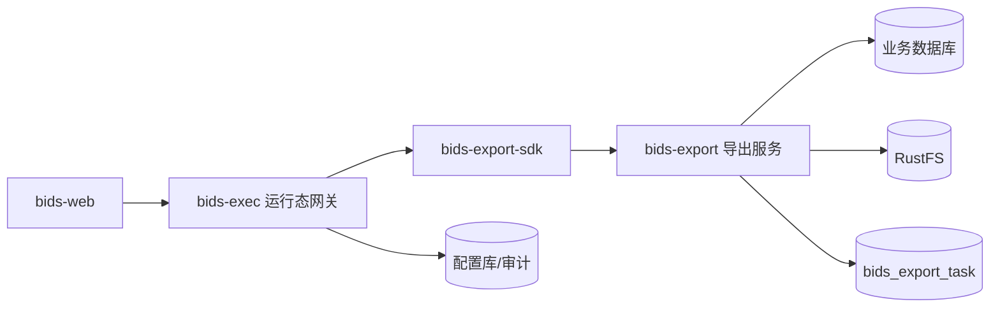
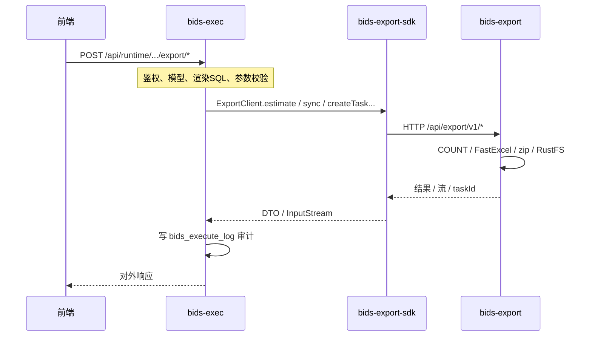
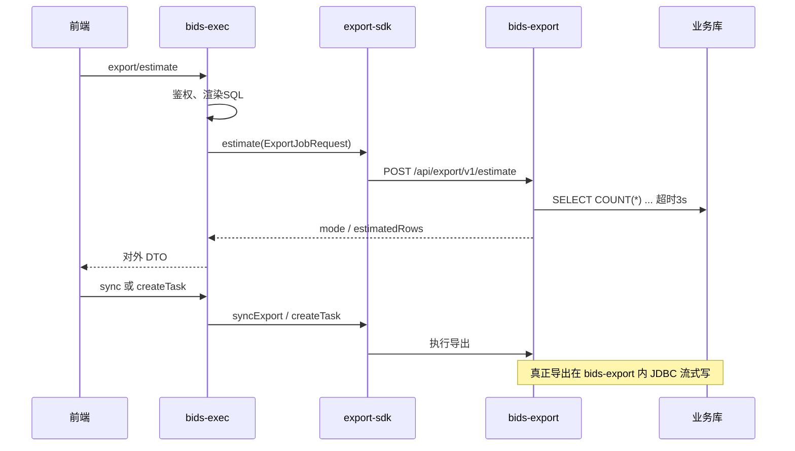
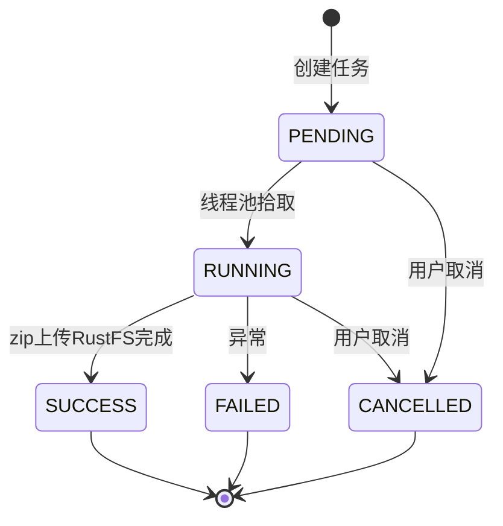

# BIDS 导出功能需求设计（定稿）

## 版本变更说明（平台化）

本设计文档最初以 `bids-export` 作为域内独立导出服务编写。根据最新架构决策，导出能力已抽取为平台级 `export-center`。  
当前文档中的 `bids-export` 语义可对应为平台导出中心实现，BIDS 保留对外接口与业务语义校验职责，导出执行由 `export-center` 统一承接。  
平台化后请以 `export-center/docs/导出中心系统设计文档.md` 为导出中心主设计依据。

## 1. 已定稿决策

| # | 项 | 定稿 |
|---|-----|------|
| 1 | 数据范围 | **全量**（当前表单参数下的完整结果集，非「查询结果」当前页） |
| 2 | 同步/异步分界 | 预估/实际符合条件行数 **≤ 10000** → **同步**；**> 10000** → **异步** |
| 3 | 交付格式 | ≤10000：**单个 xlsx**；>10000：**zip**（内含多个 xlsx 分片） |
| 4 | COUNT | 按业界成熟方案：**独立预估接口 + 超时降级 + 导出不强依赖 COUNT**（见 §5） |
| 5 | Excel 框架 | **FastExcel**（`cn.idev.excel`） |
| 6 | 对象存储 | 异步导出文件落 **本地 RustFS**（S3 兼容 API） |
| 7 | 组件形态 | **独立导出服务 `bids-export`**；**`bids-exec` 通过 `bids-export-sdk` 调用**，不在 exec 内嵌导出实现 |

---

## 2. 背景与目标

运行态「服务运行」在执行 SQL 服务后，结果区在 **运行脚本** Tab 之后新增 **服务导出** Tab。用户基于**当前查询条件**导出数据；系统按行数自动选择同步直传或异步任务，文件最终落 RustFS（异步）或直接 HTTP 下载（同步）。

复用现有能力：

| 能力 | 复用方式 |
|------|----------|
| SQL 渲染 | FreeMarker + 参数白名单，与 `execute` 相同 |
| 安全 | 只读 SELECT、模型发布态、权限 |
| 列 | `visible`、`maskType`、`label` 与 `execute` 一致 |
| 方言 | MySQL / PostgreSQL / openGauss |

---

## 3. 总体架构





### 3.1 组件职责

| 组件 | 职责 | 不负责 |
|------|------|--------|
| **bids-web** | 服务导出 Tab、轮询、下载 | 不直连 export 服务 |
| **bids-exec** | 对外 REST；模型发布态与权限；参数白名单；FreeMarker 渲染 SQL；JSqlParser 只读校验；组装 `ExportJobRequest`；调 SDK；**审计日志** | FastExcel、RustFS、任务表、业务库游标写文件 |
| **bids-export-sdk** | 封装对 export 服务的 HTTP 调用；DTO 与 `ExportClient` 接口 | 无业务逻辑 |
| **bids-export** | COUNT 预估；同步/异步导出；JDBC 流式查询；FastExcel；zip；RustFS；`bids_export_task` 持久化 | 模型权限、SQL 模板渲染 |
| **RustFS** | 异步 zip 对象存储 | — |

### 3.2 Maven 模块（对齐 `bids-sql-dialect` 模式）

```text
backend/
  bids-export-api/     # 契约：ExportClient 接口 + Request/Response DTO（无 Spring 依赖）
  bids-export-sdk/     # 实现：RestClient/HttpClient 调用 bids-export REST API
  bids-export/         # 独立 Spring Boot 应用，端口默认 8083
  bids-exec/           # 依赖 bids-export-sdk，不依赖 bids-export 实现 jar
```

父 POM `dependencyManagement` 管理 `bids-export-api`、`bids-export-sdk` 版本；`bids-export` 实现侧依赖 `bids-export-api`。

### 3.3 SDK 契约（`bids-export-api`）

```java
public interface ExportClient {
    ExportEstimateResult estimate(ExportJobRequest request);
    /** 同步导出：返回可读流，调用方负责关闭 */
    ExportSyncResult syncExport(ExportJobRequest request);
    ExportTaskRef createTask(ExportJobRequest request);
    ExportTaskStatus getTask(String taskId);
    String getDownloadUrl(String taskId);
    void cancelTask(String taskId);
    List<ExportTaskSummary> listTasks(String username, int limit);
}
```

`ExportJobRequest` 由 **exec 在鉴权与渲染完成后** 构造，字段示例：

| 字段 | 来源 |
|------|------|
| `requestId` | exec 生成的幂等 ID / 审计关联 ID |
| `modelCode` / `modelName` | 配置库 |
| `username` | 当前用户 |
| `finalSql` | exec 已渲染且通过只读校验的 SQL |
| `parameters` | 绑定参数 Map |
| `maxRows` | 模型 `maxRows` |
| `columns` | 可见列 + label + maskType |
| `dataSource` | 业务数据源 JDBC 连接信息（仅内网传递） |
| `sqlDialect` | MYSQL / POSTGRESQL / OPENGAUSS |

SDK 配置（`bids-exec`）：

```properties
bids.export.client.base-url=http://bids-export:8083
bids.export.client.connect-timeout=5s
bids.export.client.read-timeout=300s
bids.export.client.internal-token=${BIDS_EXPORT_INTERNAL_TOKEN}
```

### 3.4 服务间安全

- 前端 **仅访问** `bids-exec`；**不暴露** `bids-export` 到公网。
- exec → export：请求头 `X-Bids-Internal-Token`（共享密钥，Docker 环境变量注入）。
- export 校验 token；`username` 以 exec 传入为准（信任域内服务）。
- 下载：前端仍调 exec `.../download`，exec 调 SDK `getDownloadUrl` 后 **302** 到 RustFS 预签名 URL（凭证不离开 export 服务）。

---

## 4. 核心规则

### 4.1 全量导出

- 忽略「查询结果」分页参数（`currentPage` / `pageSize`）。
- SQL 为渲染后的只读 `SELECT`，**不套分页包装**（与 `execute` 的 `wrapSelectWithPaging` 区分）。
- 实际写入行数：`min(结果集行数, model.maxRows, bids.export.max-rows)`。

### 4.2 行数阈值与格式

| 条件 | 模式 | 用户侧格式 | 说明 |
|------|------|------------|------|
| 预估行数 ≤ 10000 | 同步 | `.xlsx` | 单文件，`Content-Disposition` 直传 |
| 预估行数 > 10000 | 异步 | `.zip` | 内含多个 `.xlsx`，见 §4.3 |

配置项：`bids.export.sync-threshold-rows=10000`（可配置，默认 10000）。

### 4.3 异步 ZIP 分片规则

对齐腾讯云等大厂实践（多 xlsx + 压缩）：

| 项 | 值 |
|----|-----|
| 单个 xlsx 最大行数 | **10000**（与同步上限一致，便于内存可控） |
| zip 内文件命名 | `{modelCode}_{taskId}_part{序号}.xlsx` |
| zip 文件名 | `{modelCode}_{yyyyMMddHHmmss}_{taskId}.zip` |
| Excel 单 Sheet 上限 | 1048576（FastExcel 多 Sheet 策略：单文件满 10000 行即落盘，不触达 Sheet 物理上限） |

示例：35000 行 → 4 个 xlsx（10000+10000+10000+5000）→ 1 个 zip → 上传 RustFS。

### 4.4 行数上限

| 层级 | 配置 | 默认 | 说明 |
|------|------|------|------|
| 模型 | `SqlModel.maxRows` | 500 | 配置态上限调整为 **1 ~ 500000**（支撑异步大导出） |
| 全局 | `bids.export.max-rows` | 500000 | 单次导出硬顶 |
| 实际导出 | `min(count, maxRows, globalMax)` | — | 达到上限时任务标记 `truncated=true` |

同步路径额外约束：即使 `maxRows` > 10000，**同步接口仅允许 ≤10000 行**；超出必须走异步。

---

## 5. COUNT 与预估（业界成熟方案）



| 场景 | 行为 |
|------|------|
| **预估接口** | `SELECT COUNT(*) FROM (renderedSql) cnt`，超时 **3s**（`bids.export.count-timeout-ms`） |
| COUNT 成功且 ≤10000 | 返回 `mode=SYNC`，前端可一键同步导出 |
| COUNT 成功且 >10000 | 返回 `mode=ASYNC`，提示「数据量较大，将生成 zip」 |
| COUNT 超时/失败 | 返回 `rowCount=null`，`mode=ASYNC_SUGGESTED`；**不阻塞**，用户确认后走异步 |
| **同步导出** | **不执行** COUNT；流式写，写满 `min(maxRows,10000)` 即停 |
| **异步导出** | 任务创建时 **不强制** COUNT；Worker 边读边写，以实际写入行数更新进度 |
| 审计 | 记录 `estimatedRows`（可空）、`actualRows`、`truncated` |

---

## 6. 技术选型：FastExcel

- 依赖：`cn.idev.excel:fastexcel`（版本在实现阶段锁定）。
- 写模式：`ExcelWriter` + `WriteSheet`，`inMemory(false)` / 默认 SXSSF 窗口刷盘。
- 动态列：按 `ResultColumn`（visible）构建 `List<List<String>>` 表头与行数据，不使用固定 `@ExcelProperty` 实体。
- JDBC：`fetchSize=1000`（可配置）；MySQL URL 增加 `useCursorFetch=true`；PostgreSQL 导出连接 `autoCommit=false`。

---

## 7. 数据模型

> 任务表归属 **`bids-export` 服务**（库可与配置库同 MySQL 实例，schema 独立或由 export 服务迁移维护）。**`bids_execute_log` 仍在 exec**，通过 `requestId` / `export_task_id` 关联。

### 7.1 表 `bids_export_task`（bids-export）

```sql
CREATE TABLE bids_export_task (
  id              VARCHAR(64)  PRIMARY KEY COMMENT '任务ID',
  model_code      VARCHAR(64)  NOT NULL,
  username        VARCHAR(128) NOT NULL,
  parameters_json TEXT         NOT NULL,
  final_sql       TEXT,
  status          VARCHAR(32)  NOT NULL COMMENT 'PENDING,RUNNING,SUCCESS,FAILED,CANCELLED',
  mode            VARCHAR(16)  NOT NULL COMMENT 'SYNC,ASYNC',
  file_format     VARCHAR(16)  NOT NULL COMMENT 'xlsx,zip',
  estimated_rows  BIGINT,
  actual_rows     BIGINT,
  truncated       TINYINT(1)   NOT NULL DEFAULT 0,
  progress_pct    INT          NOT NULL DEFAULT 0,
  error_message   VARCHAR(1024),
  rustfs_bucket   VARCHAR(128),
  rustfs_object_key VARCHAR(512),
  file_size_bytes BIGINT,
  download_expires_at DATETIME,
  created_at      DATETIME     NOT NULL,
  updated_at      DATETIME     NOT NULL,
  finished_at     DATETIME
);
CREATE INDEX idx_export_task_user_created ON bids_export_task(username, created_at DESC);
CREATE INDEX idx_export_task_status ON bids_export_task(status);
```

### 7.2 执行审计扩展（bids-exec）

`bids_execute_log` 增加（或旁路写 export_task_id）：

- `operation_type`：`EXECUTE` | `EXPORT`
- `export_task_id`（export 服务返回的 `taskId`）、`file_format`、`truncated`

---

## 8. 接口设计

### 8.0 分层说明

| 层级 | 前缀 | 调用方 | 说明 |
|------|------|--------|------|
| **对外** | `/api/runtime/...` | 前端 → **bids-exec** | 路径与鉴权不变 |
| **对内** | `/api/export/v1/...` | **bids-export-sdk** → **bids-export** | 仅内网；需 `X-Bids-Internal-Token` |

以下 8.1~8.7 为**对外接口**（exec 实现，内部转调 SDK）。8.8 为**对内接口**（export 服务实现，与 SDK 一一对应）。

### 8.1 预估行数（对外 · exec）

```http
POST /api/runtime/models/{modelCode}/export/estimate
Content-Type: application/json

{ "parameters": { } }
```

响应：

```json
{
  "estimatedRows": 12500,
  "mode": "ASYNC",
  "syncThresholdRows": 10000,
  "maxExportRows": 500000,
  "countTimedOut": false
}
```

`mode` 枚举：`SYNC` | `ASYNC` | `ASYNC_SUGGESTED`。

**exec 行为**：校验 → 构建 `ExportJobRequest` → `ExportClient.estimate()` → 映射为上述 JSON。

### 8.2 同步导出（对外 · exec，≤10000）

```http
POST /api/runtime/models/{modelCode}/export
Content-Type: application/json

{ "parameters": { } }
```

- 成功：`200`，`application/vnd.openxmlformats-officedocument.spreadsheetml.sheet`，`Content-Disposition: attachment`。
- exec 将 export 服务返回的 **流式 body 透传** 给浏览器（或缓冲后写出，优先透传）。
- 若预估 >10000 仍调此接口：`400`（exec 侧校验，不调 SDK）。

### 8.3 创建异步任务（对外 · exec，>10000）

```http
POST /api/runtime/models/{modelCode}/export/tasks
Content-Type: application/json

{ "parameters": { } }
```

响应：

```json
{
  "taskId": "uuid",
  "status": "PENDING",
  "mode": "ASYNC",
  "fileFormat": "zip"
}
```

### 8.4 查询任务

```http
GET /api/runtime/export/tasks/{taskId}
```

```json
{
  "taskId": "uuid",
  "status": "RUNNING",
  "progressPct": 45,
  "estimatedRows": 12500,
  "actualRows": 5600,
  "truncated": false,
  "fileFormat": "zip",
  "errorMessage": null,
  "downloadReady": false
}
```

`status`：`PENDING` | `RUNNING` | `SUCCESS` | `FAILED` | `CANCELLED`。

### 8.5 下载

```http
GET /api/runtime/export/tasks/{taskId}/download
```

- `SUCCESS`：302 跳转 RustFS **预签名 URL**（有效期默认 15 分钟），或由服务端代理流式转发（二选一，**推荐预签名**减轻 exec 带宽）。
- 校验：仅任务创建者或管理员可下载。

### 8.6 取消任务

```http
POST /api/runtime/export/tasks/{taskId}/cancel
```

仅 `PENDING` / `RUNNING` 可取消。

### 8.7 我的导出列表

```http
GET /api/runtime/export/tasks?limit=20
```

exec 调 `ExportClient.listTasks(username, limit)`；用于「服务导出」Tab。

### 8.8 对内接口（bids-export · SDK 调用）

| 方法 | 路径 | 说明 |
|------|------|------|
| POST | `/api/export/v1/estimate` | Body: `ExportJobRequest` → `ExportEstimateResult` |
| POST | `/api/export/v1/jobs/sync` | 同步，响应流 `application/vnd...sheet` |
| POST | `/api/export/v1/jobs` | 创建异步任务 → `{ taskId, status, fileFormat }` |
| GET | `/api/export/v1/jobs/{taskId}` | 任务状态与进度 |
| GET | `/api/export/v1/jobs/{taskId}/download-url` | 预签名 URL（JSON，供 exec 302） |
| POST | `/api/export/v1/jobs/{taskId}/cancel` | 取消 |
| GET | `/api/export/v1/jobs?username=&limit=` | 任务列表 |

错误体统一：`{ "code": "...", "message": "..." }`；SDK 映射为 `ExportException`。

---

## 9. 异步任务执行流程（bids-export 内部）



| 步骤 | 说明 |
|------|------|
| 1 | 接收 `ExportJobRequest`（exec 已完成鉴权与 SQL 校验） |
| 2 | 状态 → `RUNNING`，更新 `progress` |
| 3 | 按请求内 `dataSource` 建连，JDBC 流式读 `finalSql` |
| 4 | 每满 10000 行 FastExcel 落临时 xlsx |
| 5 | `ZipOutputStream` 打包 → 上传 RustFS |
| 6 | 更新任务 `SUCCESS`、对象 Key、`download_expires_at` |
| 7 | 删除本地临时目录 |

线程池：`bids.export.async-pool-size`（**export 服务**配置，默认 2）；**单用户同时仅 1 个 RUNNING 任务**（export 服务内校验 `username`）。

---

## 10. RustFS 对象存储

### 10.1 部署

本地 Docker 与 BIDS 同网段（`docker-compose` 增补服务）：

```yaml
rustfs:
  image: rustfs/rustfs:latest
  container_name: bids-rustfs
  ports:
    - "9000:9000"   # S3 API
    - "9001:9001"   # 控制台
  environment:
    RUSTFS_ACCESS_KEY: ${RUSTFS_ACCESS_KEY:-rustfsadmin}
    RUSTFS_SECRET_KEY: ${RUSTFS_SECRET_KEY:-rustfsadmin}
  volumes:
    - bids_rustfs_data:/data
  networks:
    - bids
```

`bids-export` 环境变量示例（**仅 export 服务持有**）：

```properties
bids.export.rustfs.endpoint=http://rustfs:9000
bids.export.rustfs.access-key=rustfsadmin
bids.export.rustfs.secret-key=rustfsadmin
bids.export.rustfs.bucket=bids-export
bids.export.rustfs.region=us-east-1
bids.export.rustfs.path-style-access=true
```

启动时由 **`bids-export`** 检查 bucket 是否存在，不存在则创建。

### 10.2 访问方式

- SDK：**AWS SDK for Java v2**（`S3Client` + `S3Presigner`），与 [RustFS S3 兼容说明](https://docs.rustfs.com/zh) 一致。
- 对象 Key：`exports/{yyyyMM}/{taskId}.zip`
- 预签名 GET：默认 **900s**（`bids.export.download-url-ttl-seconds`）
- 生命周期：RustFS 桶策略或定时任务 **30 天**删除；任务表 `download_expires_at` 与对象清理对齐

### 10.3 安全

- RustFS 凭证仅 **`bids-export`** 持有。
- 下载：前端 → exec 鉴权 → SDK `getDownloadUrl` → exec 302 预签名 URL。

---

## 11. 前端：服务导出 Tab

位置：`RunQuery.vue` → 结果区 `el-tabs`，在 **运行脚本** 之后。

| 元素 | 行为 |
|------|------|
| 说明文案 | 导出当前表单条件下的**全量**数据，与表格分页无关 |
| 预估 | 进入 Tab 或点击「导出」前调 `estimate`，展示约 N 行及同步/异步提示 |
| 导出按钮 | `mode=SYNC` → 调同步接口，浏览器下载 xlsx；`ASYNC*` → 创建任务 |
| 异步进度 | 每 **3s** 轮询 `GET .../tasks/{id}`，展示进度条；`SUCCESS` 后显示「下载 zip」 |
| 任务列表 | 本 Tab 下方展示当前用户最近 20 条导出记录 |
| 禁用态 | 未执行过查询（无 `result`）时禁用并提示 |

---

## 12. 安全、审计与限流

| 项 | 规则 |
|----|------|
| 认证（对外） | 与 `execute` 相同 Header 认证，**仅 exec** |
| 认证（对内） | `X-Bids-Internal-Token`，**仅 export 服务校验** |
| 权限 | **exec**：模型已发布 + `bids_model_permission` |
| 审计 | **exec** 写 `bids_execute_log`（`operation_type=EXPORT`） |
| 用户并发 | **export 服务** 内每用户最多 1 个 `RUNNING` |
| 全局并发 | **export** 线程池（默认 2） |
| 频率 | **exec** 侧每用户每分钟最多 10 次创建导出（estimate 不计） |
| 脱敏 | **export** 按 `ExportJobRequest.columns` 的 `maskType` 执行 |

---

## 13. 非功能需求

| 项 | 指标 |
|----|------|
| 同步性能 | 10000 行 × 20 列，P95 &lt; 90s（内网） |
| 异步性能 | 50000 行 zip，P95 &lt; 10min（视业务库而定） |
| HTTP 超时 | 网关/sync 读超时 ≥ **300s** |
| 磁盘 | 异步临时目录 `bids.export.temp-dir`，任务结束即删；单任务临时空间上限 **2GB**，超限 `FAILED` |
| 可用性 | RustFS 不可用时异步任务 `FAILED`，错误信息明确 |
| 兼容 | 业务库 MySQL / PostgreSQL / openGauss |

---

## 14. 配置项汇总

### 14.1 bids-exec

| 配置键 | 默认值 | 说明 |
|--------|--------|------|
| `bids.export.client.base-url` | `http://bids-export:8083` | SDK 指向 export 服务 |
| `bids.export.client.internal-token` | — | 内网调用令牌 |
| `bids.export.client.read-timeout` | 300s | 同步导出读超时 |
| `bids.export.rate-limit-per-minute` | 10 | 每用户创建导出频率 |

### 14.2 bids-export（导出服务）

| 配置键 | 默认值 | 说明 |
|--------|--------|------|
| `bids.export.sync-threshold-rows` | 10000 | 同步/异步分界 |
| `bids.export.max-rows` | 500000 | 单次导出硬顶 |
| `bids.export.count-timeout-ms` | 3000 | COUNT 超时 |
| `bids.export.fetch-size` | 1000 | JDBC fetchSize |
| `bids.export.xlsx-shard-rows` | 10000 | zip 分片行数 |
| `bids.export.async-pool-size` | 2 | 异步线程池 |
| `bids.export.download-url-ttl-seconds` | 900 | 预签名有效期 |
| `bids.export.file-retention-days` | 30 | 对象与任务保留 |
| `bids.export.rustfs.*` | 见 §10 | RustFS |
| `bids.export.internal-token` | — | 与 exec 一致 |

配置态 `bids-config`：`SqlModelRequest.maxRows` 校验上限 **500000**。

---

## 15. 实现模块划分

### 15.1 bids-export-api

```text
com.yeswater.bids.export.api
  ExportClient
  ExportJobRequest, ExportEstimateResult, ExportSyncResult
  ExportTaskRef, ExportTaskStatus, ExportTaskSummary
  ExportException
```

### 15.2 bids-export-sdk

```text
com.yeswater.bids.export.sdk
  HttpExportClient implements ExportClient
  ExportClientAutoConfiguration   # Spring Boot 自动配置，供 exec 引入
  ExportClientProperties
```

### 15.3 bids-export（Spring Boot 应用）

```text
com.yeswater.bids.export
  interfaces/rest/ExportV1Controller
  application/ExportEstimateService
  application/ExportSyncService
  application/ExportAsyncService, ExportWorker
  domain/model/ExportTask
  infrastructure/excel/FastExcelRowWriter
  infrastructure/jdbc/JdbcStreamingQuery
  infrastructure/storage/RustfsExportStorage
  infrastructure/persistence/ExportTaskRepository
```

### 15.4 bids-exec（网关层）

```text
com.yeswater.bids.exec
  application/RuntimeExportFacade    # 组装 ExportJobRequest，调 ExportClient
  interfaces/rest/RuntimeExportController   # 对外 /api/runtime/.../export/*
```

### 15.5 部署（docker-compose 增补）

```yaml
bids-export:
  build:
    context: .
    dockerfile: docker/bids-export/Dockerfile
  image: bids-export:latest
  container_name: bids-export
  depends_on:
    mysql:
      condition: service_healthy
    rustfs:
      condition: service_started
  environment:
    SPRING_PROFILES_ACTIVE: docker
    BIDS_EXPORT_DB_URL: jdbc:mysql://mysql:3306/bids?...
    BIDS_EXPORT_INTERNAL_TOKEN: ${BIDS_EXPORT_INTERNAL_TOKEN:-change-me}
    BIDS_EXPORT_RUSTFS_ENDPOINT: http://rustfs:9000
  ports:
    - "8083:8083"
  networks:
    - bids

# bids-exec 增加
#   BIDS_EXPORT_CLIENT_BASE_URL: http://bids-export:8083
#   BIDS_EXPORT_INTERNAL_TOKEN: ${BIDS_EXPORT_INTERNAL_TOKEN:-change-me}
```

---

## 16. 附录：框架选型摘要

| 框架 | 结论 |
|------|------|
| FastExcel | **采用**，流式写、动态列 |
| EasyExcel | 不采用（维护态，与 FastExcel 同源） |
| 裸 POI | 不采用 |
| JXLS | 不采用（固定模板场景） |

---

## 17. 验收要点

- [ ] ≤10000 行：经 **exec → SDK → export** 同步下载 xlsx，列与脱敏正确
- [ ] >10000 行：异步任务在 **export** 完成，zip 经 exec 鉴权后下载
- [ ] 全量：与当前表单参数一致，不受分页影响
- [ ] COUNT 3s 超时后可走异步（export 内实现）
- [ ] 文件存 RustFS（export 上传），预签名经 exec 302
- [ ] exec 审计、权限与 execute 一致；export 不对外暴露
- [ ] exec 进程内 **无** FastExcel / RustFS 依赖，仅依赖 `bids-export-sdk`
