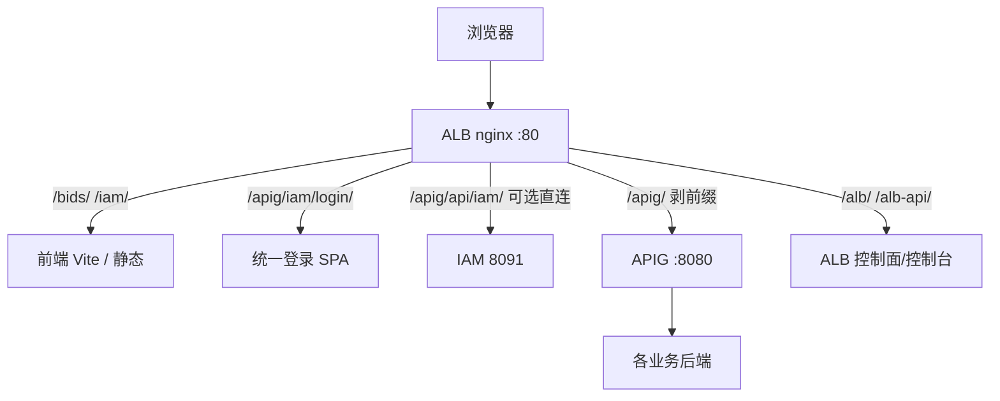
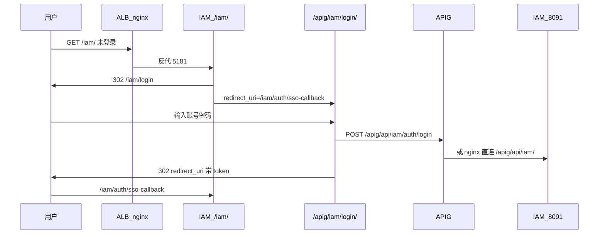

# YEDS ALB 路由与部署指南

本文是 YEDS 平台 **ALB（边缘路由）** 的集中说明：部署步骤、默认转发策略、路由管理与 ALB/APIG 分工。实现代码与配置文件位于仓库 [`alb/`](../alb/)。

**相关文档**

| 文档 | 说明 |
|------|------|
| [Yeswater 企业数字化系统规划](./Yeswater企业数字化系统规划.md) | 平台组件总览 |
| [SSO 接入说明](./sso接入说明.md) | 登录与跨应用跳转（须配合 ALB 文根） |
| [BIDS 接入 yeds 安全加固联调说明](./BIDS接入yeds安全加固联调说明.md) | APIG 鉴权与 trusted header |
| [APIG 详细设计](../apig/docs/java-apig-详细设计与4+1视图.md) | API 网关层 |

---

## 1. 定位：ALB 与 APIG 分工



| 层级 | 组件 | 职责 |
|------|------|------|
| **边缘路由（ALB）** | `alb/deploy/nginx` | 单域 + **文根** 转发；SPA/静态；边缘 Header；WebSocket（Vite HMR） |
| **API 网关（APIG）** | `apig/gateway-dataplane` | JWT 验签、IAM 远程鉴权、限流、向下游注入 `X-Bids-*` 等 |
| **身份（IAM）** | `iam/backend` | 登录、令牌、JWKS、策略 API；托管统一登录静态资源 |

**固定链路**：`浏览器 → ALB →（/apig）→ APIG → 业务服务`。禁止在 ALB 层重复 JWT 验签。

---

## 2. 域名与访问入口

### 2.1 推荐本地域名

| 域名 | 说明 |
|------|------|
| **`localhost`** | 无需额外 hosts，优先使用 |
| **`yeds.local`** | 无公网 DNS，推荐长期本地开发 |
| `yeds.com` | 须在 `/etc/hosts` 指向 `127.0.0.1`；公网同名域名为停放页，会跳转 `/lander` |

> **注意**：Chrome「使用安全 DNS」（DoH）可能 **绕过 `/etc/hosts`**，导致 `yeds.com` 仍解析到公网。请关闭该选项，或改用 `localhost` / `yeds.local`。

### 2.2 配置 hosts

```bash
./alb/deploy/scripts/install-hosts.sh
```

写入示例（见 [`alb/deploy/hosts.example`](../alb/deploy/hosts.example)）：

```text
127.0.0.1 yeds.local www.yeds.local yeds.com www.yeds.com localhost
```

验证：

```bash
ping -c 1 yeds.local    # 应显示 127.0.0.1
```

### 2.3 常用访问地址（Docker nginx 监听 80）

| 应用 | URL |
|------|-----|
| IAM 管理台 | http://localhost/iam/ 或 http://yeds.local/iam/ |
| BIDS 控制台 | http://localhost/bids/ |
| 统一登录 | http://localhost/apig/iam/login/ |
| 北向 API（经 APIG） | http://localhost/apig/api/... |
| ALB 控制台 | http://localhost/alb/ |
| ALB 控制面 API | http://localhost/alb-api/v1/... |

---

## 3. 默认路由转发策略

ALB 数据面使用 **nginx**（[`alb/deploy/nginx/nginx.docker.conf`](../alb/deploy/nginx/nginx.docker.conf)）。匹配规则：**location 最长前缀优先**；同长度时配置文件中的声明顺序生效。

### 3.1 文根路由表（开发默认）

| 优先级 | 浏览器路径 | 反代目标（宿主机） | 说明 |
|--------|------------|-------------------|------|
| 高 | `/apig/iam/login/` | `8091` → `/iam/login/` | 统一登录 SPA（静态 + 页面） |
| 高 | `/iam/login/` | `8091` → `/iam/login/` | 同上（兼容路径） |
| 高 | `/apig/api/iam/` | `8091` → `/api/iam/` | IAM API **直连**（未起 APIG 时可用） |
| 中 | `/apig/` | `8080` → `/` | APIG；**剥掉** `/apig` 前缀 |
| 中 | `/bids/` | `5173` → `/bids/` | BIDS 前端（Vite `base=/bids/`） |
| 中 | `/iam/` | `5181` → `/iam/` | IAM 前端（Vite `base=/iam/`） |
| 中 | `/alb/` | `5185` → `/alb/` | ALB 管理控制台 |
| 低 | `/alb-api/` | `8095` → `/api/alb/` | ALB 控制面 REST API |
| — | `/` | 302 → `/bids/` | 根路径默认进 BIDS |

### 3.2 路径改写示意

```text
GET http://yeds.local/apig/api/config/models
  → nginx location /apig/（剥前缀）
  → http://127.0.0.1:8080/api/config/models
  → APIG → bids-config

GET http://yeds.local/apig/api/iam/auth/login
  → nginx location /apig/api/iam/（优先于 /apig/）
  → http://127.0.0.1:8091/api/iam/auth/login
  → IAM 后端（可不经 APIG）

GET http://yeds.local/bids/run/svc
  → http://127.0.0.1:5173/bids/run/svc
  → BIDS Vite
```

### 3.3 前端 base 与 API 前缀

各前端开发环境约定（`.env.development`）：

| 应用 | Vite `base` | 浏览器 API 前缀 |
|------|-------------|-----------------|
| BIDS | `/bids/` | `VITE_API_BASE=/apig` |
| IAM | `/iam/` | `VITE_API_BASE_URL=/apig` |
| 统一登录 | `/iam/login/`（构建产物） | `POST /apig/api/iam/auth/login` |

平台切换、登录回跳使用 **当前站点 `origin` + 文根**（如 `http://yeds.local/iam/auth/sso-callback`），避免写死端口。

### 3.4 Header 策略（控制面可配）

与阿里云 MSE「Header 修改策略」语义一致，在 **ALB 控制台** 按路由绑定：

| 操作 | 行为 |
|------|------|
| `add` | 已存在则逗号拼接 |
| `set` | 覆盖或新建 |
| `remove` | 删除 |

方向：`request`（发往上游）、`response`（返回浏览器）。**JWT / 身份头** 仍在 APIG 注入，不在 ALB 重复处理。

---

## 4. 部署教程

### 4.1 前置条件

- Docker（用于 nginx 数据面）
- JDK 21 + Maven（ALB 控制面、IAM、APIG、BIDS 后端）
- Node.js（各前端 `npm run dev`）

### 4.2 启动 ALB 数据面（nginx）

```bash
cd alb/deploy
docker compose up -d
```

- 容器名：`yeds-alb-nginx`
- 映射端口：**80**（勿与占用 9080 的旧 `alb-dataplane` 冲突）
- 配置：[`nginx.docker.conf`](../alb/deploy/nginx/nginx.docker.conf)（上游为 `host.docker.internal`）

检查：

```bash
docker ps | grep yeds-alb-nginx
curl -sI -H "Host: localhost" http://127.0.0.1/iam/ | head -3
```

### 4.3 启动业务服务（推荐顺序）

| 顺序 | 服务 | 命令 / 端口 |
|------|------|-------------|
| 1 | IAM 后端 | `cd iam/backend && mvn spring-boot:run` → **8091** |
| 2 | APIG | `cd apig/gateway-dataplane && mvn spring-boot:run` → **8080** |
| 3 | 统一登录静态资源 | `cd shared/frontend/yeds-login-web && npm run build:deploy` |
| 4 | BIDS 前端 | `cd bids/frontend && npm run dev` → **5173** |
| 5 | IAM 前端 | `cd iam/frontend && npm run dev` → **5181** |
| 6 | ALB 控制面（可选） | `cd alb/alb-controlplane && mvn spring-boot:run` → **8095** |
| 7 | ALB 控制台（可选） | `cd alb/alb-console && npm run dev` → **5185** |

中间件（MySQL 等）按 [BIDS 本地构建规则](../bids/docker-compose.yml) 仅起依赖容器，业务进程在宿主机运行。

### 4.4 本机 nginx（不用 Docker 时）

参考 [`alb/deploy/nginx/nginx.dev.conf`](../alb/deploy/nginx/nginx.dev.conf)，上游为 `127.0.0.1`。需 root 或 setcap 监听 80/9080。

---

## 5. 路由管理（控制面）

### 5.1 模块结构

```
alb/
  alb-controlplane/     # REST API :8095，路由 CRUD、发布、生成 nginx.conf
  alb-console/          # 管理 UI，经 /alb/ 访问
  alb-dataplane/        # 已废弃，由 nginx 承担数据面
  deploy/nginx/         # 当前生效的转发配置（可手写或由发布生成）
```

### 5.2 领域模型

| 实体 | 说明 |
|------|------|
| `Upstream` | 上游地址（如 `http://127.0.0.1:5173/bids`） |
| `Route` | `host` + `path_pattern` + `priority` + 绑定上游 |
| `HeaderPolicy` | 路由级请求/响应头策略 |
| `RouteRelease` | 发布版本与 nginx 配置快照 |

**匹配顺序**（数据面逻辑）：`enabled` → Host → Path 最长前缀 → `priority` 降序。

### 5.3 控制面 API（`/api/alb/v1`）

经浏览器访问时需走 ALB：`http://localhost/alb-api/v1/...`

| 方法 | 路径 | 说明 |
|------|------|------|
| GET/POST | `/upstreams` | 上游 |
| GET/POST | `/routes` | 路由 |
| GET/POST | `/routes/{id}/headers` | Header 策略 |
| POST | `/publish` | 发布，生成 `alb-controlplane/generated/nginx.conf` |
| GET | `/publish/nginx-preview` | 预览 nginx 配置 |
| GET | `/snapshot` | 当前快照（供旧 dataplane 拉取，可选） |

控制台操作：访问 **http://localhost/alb/** → 编辑路由 / Header → 点击 **发布配置**。

或使用 curl：

```bash
curl -X POST http://127.0.0.1:8095/api/alb/v1/publish
```

### 5.4 修改路由后生效方式

1. 在控制台或 API 中增删改路由、Header。
2. **发布配置**。
3. 将生成的 `generated/nginx.conf` 合并到 `deploy/nginx/`，或替换对应 `location`。
4. `docker compose up -d --force-recreate` 重载 nginx。

种子数据见 [`alb-controlplane/src/main/resources/data.sql`](../alb/alb-controlplane/src/main/resources/data.sql)（`yeds.com` / `localhost` 文根）。

---

## 6. 与 SSO / 登录集成



- 统一登录页规范见 [.cursor/rules/yeds-frontend-ui-style.mdc](../.cursor/rules/yeds-frontend-ui-style.mdc)（`YedsLoginPage`、居中卡片）。
- 构建登录页：`cd shared/frontend/yeds-login-web && npm run build:deploy`。
- 详细回调约定见 [SSO 接入说明](./sso接入说明.md)（部署 ALB 后，文档中的端口应理解为 **同源 + 文根**，如 `http://yeds.local/iam/`）。

---

## 7. 端口与冲突

| 端口 | 占用方 | 说明 |
|------|--------|------|
| **80** | `yeds-alb-nginx` | 浏览器统一入口 |
| **8080** | APIG | 勿与 `bids-web` Docker 容器同时占用 |
| **8081–8083** | BIDS 后端 | |
| **8091** | IAM 后端 | |
| **8095** | ALB 控制面 | |
| **5173 / 5181 / 5185** | BIDS / IAM / ALB 前端 Vite | |
| ~~9080~~ | 旧 `alb-dataplane` | 已废弃，勿与 Docker 映射冲突 |

---

## 8. 常见问题

### 8.1 打开 yeds.com 跳到公网 /lander

- **原因**：公网 DNS 解析到停放页；或 DoH 绕过 hosts。
- **处理**：使用 `http://localhost/...` 或 `http://yeds.local/...`；执行 `install-hosts.sh`；关闭浏览器安全 DNS。

### 8.2 登录页样式错乱（无居中卡片）

- **原因**：`yeds-login-web` 未引入 `yeds-login-page.css`。
- **处理**：`npm run build:deploy` 后强刷浏览器；确认 Network 中 CSS 200。

### 8.3 API 401

- 确认请求走 **`/apig/...`** 且 APIG、IAM 已启动。
- 仅 IAM 联调时可依赖 nginx 将 `/apig/api/iam/` 直连 8091。

### 8.4 Docker nginx 502

- 确认宿主机上对应端口已监听（Vite / Spring Boot）。
- macOS 上 Docker 通过 `host.docker.internal` 访问宿主机。

---

## 9. 演进路线

| 阶段 | 内容 | 状态 |
|------|------|------|
| P0 | 平台文档 + nginx 种子配置 | 本文档 |
| P1 | nginx 文根路由 + 各前端 base | 已落地 |
| P2 | 控制面 + 控制台 CRUD / 发布 | 已落地 |
| P3 | TLS（mkcert）、访问日志、灰度权重 | 规划 |
| P4 | 生产 K8s Ingress / 与配置中心联动 | 规划 |

---

## 10. 仓库内其他参考

| 路径 | 内容 |
|------|------|
| [`alb/README.md`](../alb/README.md) | 模块快速索引 |
| [`alb/docs/路由服务设计文档.md`](../alb/docs/路由服务设计文档.md) | 设计细节与业界选型 |
| [`alb/docs/本地开发指南.md`](../alb/docs/本地开发指南.md) | 与本文 §4 同步的简版步骤 |
