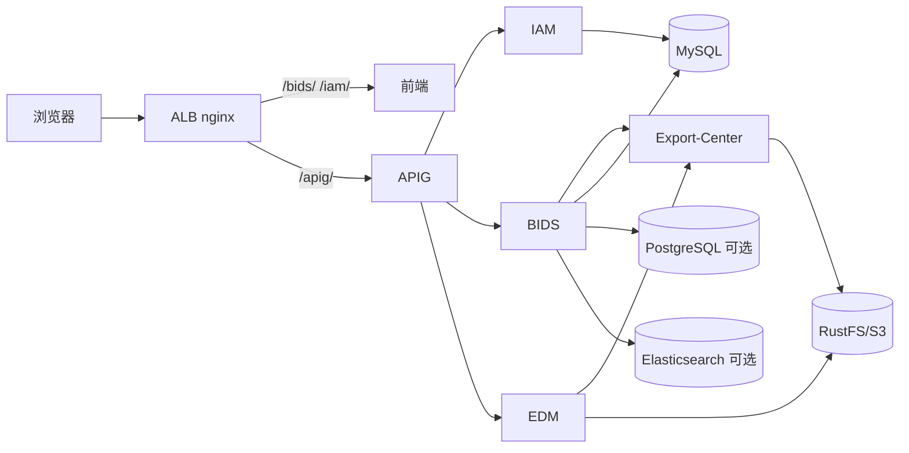

# Yeswater企业数字化系统规划

## 1. 平台定位

YEDS（Yeswater Enterprise Digital System）是 Yeswater 的企业数字化平台，采用单仓多组件（Monorepo）模式，目标是形成“统一接入、统一身份、统一导出治理、统一文档治理、业务域解耦演进”的企业级技术底座。

当前平台组件：

- `alb/`：边缘路由（单域文根转发、静态反代、Header 策略；见 [ALB路由与部署指南](./ALB路由与部署指南.md)）
- `apig/`：统一 API 接入与流量治理
- `iam/`：统一身份与权限治理
- `bids/`：业务规则配置与数据服务执行
- `export-center/`：平台级导出任务中心
- `edm/`：企业文档管理与文档治理

## 2. 平台目标架构

架构原则：

- 浏览器统一经 **ALB**（文根 `/bids`、`/iam`、`/apig` 等）进入平台。
- 北向 **API** 统一经 `apig`（浏览器侧路径为 `/apig/api/...`）。
- 身份与权限统一由 `iam` 提供基线。
- 导出执行统一下沉到 `export-center`，业务域只保留语义与权限边界。
- 文档资产治理由 `edm` 承担，支持与导出中心协同归档。

## 3. 组件职责边界

### 3.1 `alb`

- 边缘反向代理：单域 + 文根路由、前端 SPA/静态、统一登录页入口、可选 Header 策略。
- 路由配置与发布见 [ALB路由与部署指南](./ALB路由与部署指南.md)；**不**做 JWT 验签（由 APIG 负责）。

### 3.2 `apig`

- API 统一入口、认证编排、限流与观测接入。
- 不承载业务规则，不侵入业务域模型。

### 3.3 `iam`

- 统一用户、组织、角色、应用身份模型。
- 提供认证、鉴权、策略、审计能力输出。

### 3.4 `bids`

- 负责 SQL 模型配置、运行态执行、业务参数治理与审计。
- 对接 `export-center` 完成导出编排，不直接承担大文件导出执行。

### 3.5 `export-center`

- 提供统一导出任务状态机、文件生成、对象存储、下载分发、导出审计。
- 作为跨业务复用的公共技术组件，不承载业务权限语义。

### 3.6 `edm`

- 提供文档全生命周期管理：上传、版本、检索、分享、归档、审计。
- 对接 `export-center` 实现批量导出与归档包导出。

## 4. 子系统成熟度与规划

| 组件 | 当前状态 | 当前重点 | 下一阶段目标 |
|---|---|---|---|
| `apig` | 已有实现基础 | 路由与认证主链路稳态 | 控制面发布治理与可观测增强 |
| `iam` | 设计与实施文档阶段 | 认证/鉴权 MVP 落地 | RBAC+ABAC 策略增强 |
| `bids` | 已运行 | 查询链路稳定与治理补齐 | 模型版本治理、配额治理 |
| `export-center` | 设计完成 | 从 `bids-export` 迁移能力 | 跨域复用与统一导出看板 |
| `edm` | 设计阶段 | 文档管理 MVP | 与导出中心联动归档闭环 |

## 5. 分阶段建设路线图

### 阶段1：平台主链路（当前）

- 打通 `apig + iam + bids` 基础调用链路。
- 保证 BIDS 配置态与执行态稳定运行。
- 完成导出能力抽象，明确 `export-center` 目标边界。

### 阶段2：治理增强（近期）

- IAM 完成认证/鉴权服务化落地。
- BIDS 接入平台导出中心，替代域内导出执行实现。
- EDM 完成文档治理 MVP 并打通导出归档。

### 阶段3：平台化深化（中期）

- 统一策略中心（权限、配额、下载策略）。
- 统一可观测（指标、日志、链路、告警）。
- 推进多租户与环境隔离能力。

## 6. 仓库结构与文档治理约定

### 6.1 目录约定

- 组件代码统一在一级目录：`apig/`、`iam/`、`bids/`、`export-center/`、`edm/`。
- 平台总规划文档放在 `docs/`。
- 组件设计文档放在各自目录 `*/docs/`。

### 6.2 关键设计文档基线

- `bids/docs/BIDS系统设计文档.md`
- `iam/docs/iam系统设计文档.md`
- `edm/docs/EDM系统设计文档.md`
- `export-center/docs/导出中心系统设计文档.md`
- `env/构建环境.md`

### 6.3 分支与发布约定

- 默认分支：`main`
- 功能分支：`feature/<component>-<topic>`
- 修复分支：`fix/<component>-<topic>`
- 建议标签：
  - 组件标签：`<component>/vX.Y.Z`
  - 平台里程碑：`yeds/vX.Y.Z`

## 7. 工程治理与 CI/CD 建议

- 按目录触发组件流水线，避免全仓无差别构建。
- 每个组件流水线至少包含：构建、静态检查、安全扫描、制品归档。
- 平台集成流水线至少包含：关键链路冒烟（`apig -> iam -> bids`、`bids -> export-center`、`edm -> export-center`）。
- 统一版本发布说明模板，约束跨组件依赖变更说明。

## 8. 跨组件标准化建议

- 统一错误码与异常响应模型（平台级规范）。
- 统一审计事件模型（操作人、资源、动作、结果、traceId）。
- 统一配置命名规范（环境变量前缀、敏感配置管理策略）。
- 统一 API 契约管理（OpenAPI 版本化、向后兼容策略）。

## 9. 风险与控制措施

- 组件边界漂移：通过 ADR + 接口评审约束“谁负责什么”。
- 平台能力重复建设：导出、身份、审计等公共能力坚持中心化实现。
- 联调成本高：提供双模式环境文档（全栈 Docker / 本机开发）并固化端口基线。
- 变更影响面不透明：引入跨组件影响清单与发布门禁。

## 10. 下一步执行清单

1. 完成 `export-center` 代码模块化落地与 BIDS 迁移计划。
2. 完成 IAM MVP（登录、鉴权、JWK、审计）并接入 APIG。
3. 完成 EDM MVP 与导出归档链路打通。
4. 建立平台 ADR 目录并沉淀关键架构决策。
5. 建立平台统一接口与错误码规范文档。
