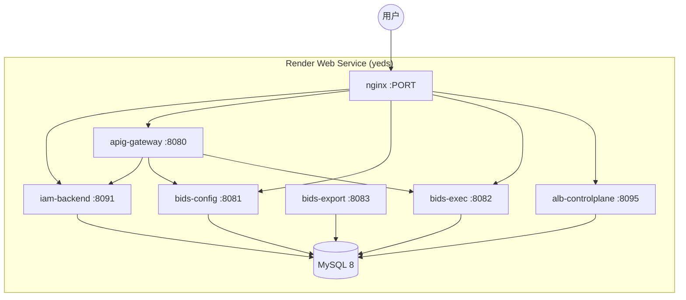

# YEDS 部署到 Render

Render 上采用 **单 Web 服务 + 单 Docker 镜像** 运行全栈（MySQL、六个 Java 服务、三个前端静态资源、ALB 风格 nginx 入口），与本地 `docker compose --profile full` 能力对齐，但**不**包含 PostgreSQL / Elasticsearch / RustFS（导出使用本地存储，审计 ES 默认关闭）。

## 架构



| 路径 | 说明 |
|------|------|
| `/` | 302 → `/bids/` |
| `/bids/` | BIDS 控制台 |
| `/iam/` | IAM 控制台 |
| `/alb/` | ALB 路由管理 |
| `/apig/` | API 网关 |

## 前置条件

1. 代码已推送到 **GitHub / GitLab / Bitbucket**（本仓库默认：`https://github.com/Yeswater/yeds`）。
2. [Render](https://render.com) 账号；Blueprint 默认 **`plan: free`**（512MB，六个 JVM 易 OOM）；不稳定时可改为 Starter 及以上（约 **1GB+** 更稳妥）。
3. （可选）安装 [Render CLI](https://render.com/docs/cli) 用于校验 Blueprint：`render blueprints validate`。

## 一键 Blueprint 部署

1. 确认仓库根目录已有 `render.yaml` 与 `deploy/render/Dockerfile`。
2. 提交并推送：

   ```bash
   git add render.yaml deploy/render docs/deploy-render.md
   git commit -m "Add Render Blueprint for YEDS all-in-one deployment"
   git push origin main
   ```

3. 打开 Blueprint 创建页（将 `repo` 换成你的 HTTPS 仓库地址）：

   ```
   https://dashboard.render.com/blueprint/new?repo=https://github.com/Yeswater/yeds
   ```

4. 连接 Git 提供方 → 审阅服务 `yeds` → 在 Dashboard 填写 **`BIDS_ADMIN_PASSWORD`**（`sync: false`）→ **Apply**。
5. 首次构建约 **15–25 分钟**（Maven + 三个前端）；启动健康检查 `start_period` 最长约 5 分钟。

部署完成后访问：`https://<service-name>.onrender.com/bids/`（默认账号见环境变量 `BIDS_ADMIN_USERNAME` / `BIDS_ADMIN_PASSWORD`）。

## 环境变量

| 变量 | 说明 |
|------|------|
| `PORT` | Render 注入；nginx 监听此端口（Blueprint 默认 `10000`） |
| `MYSQL_ROOT_PASSWORD` | 自动生成 |
| `MYSQL_PASSWORD` | 自动生成，同时作为 `bids` 库用户密码 |
| `BIDS_EXPORT_INTERNAL_TOKEN` | 自动生成 |
| `BIDS_ADMIN_PASSWORD` | **需在 Dashboard 手动设置** |
| `JAVA_TOOL_OPTIONS` | JVM 堆上限，内存不足时可改为 `-Xms32m -Xmx96m` |

## 限制与生产建议

| 项 | 说明 |
|----|------|
| 文件系统 | **临时盘**：重建/发布即丢库；仅适合演示，生产请用 [Render Postgres](https://render.com/docs/databases) 或托管 MySQL 并改 JDBC 环境变量 |
| Free 实例 | 15 分钟无流量休眠；单容器 512MB 可能无法稳定启动六个 JVM |
| ES / PG / RustFS | 未打包；需金融 PG 演示或 ES 审计时请用根目录 Compose 全栈或拆多服务 Blueprint |
| 构建时间 | 镜像内完整 `mvn package` + `npm ci`，建议使用 Render 构建缓存或 CI 预构建推 Registry 后改 `runtime: image` |

## 本地验证镜像（可选）

```bash
cd /path/to/yeds
docker build -f deploy/render/Dockerfile -t yeds-render:local .
docker run --rm -p 10000:10000 \
  -e PORT=10000 \
  -e MYSQL_ROOT_PASSWORD=local-root \
  -e MYSQL_PASSWORD=bids \
  -e BIDS_ADMIN_PASSWORD=admin \
  yeds-render:local
# 浏览器 http://127.0.0.1:10000/bids/
```

## Cursor + Render MCP（可选）

在 `~/.cursor/mcp.json` 配置 [Render MCP](https://render.com/docs/mcp-server) 后，可在对话中查看部署日志与指标。首次需执行「Set my Render workspace to …」选择工作区。

## 相关文件

| 文件 | 作用 |
|------|------|
| [render.yaml](../render.yaml) | Blueprint 定义 |
| [deploy/render/Dockerfile](../deploy/render/Dockerfile) | 多阶段构建 |
| [deploy/render/start.sh](../deploy/render/start.sh) | 进程启动顺序 |
| [deploy/render/nginx.render.conf.template](../deploy/render/nginx.render.conf.template) | 边缘路由 |

本地日常开发仍推荐：**中间件 Docker + 宿主机 `mvn`/`npm`**，见 [env/构建环境-本机开发模式.md](../env/构建环境-本机开发模式.md)。
