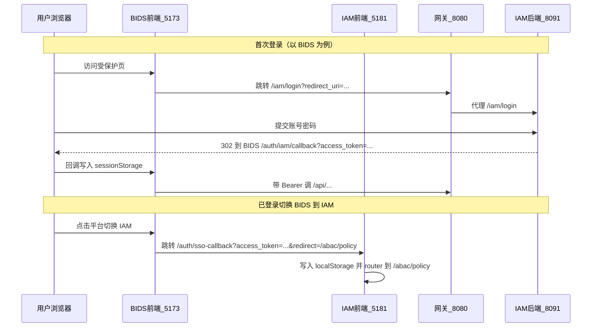

# yeds 平台 SSO 接入说明

本文描述 BIDS 与 IAM 前端在**已登录状态下切换平台**时的 SSO 行为，以及首次登录与跨应用会话桥接的约定。

> **经 ALB 联调**：浏览器统一入口为 `http://localhost` 或 `http://yeds.local`（文根 `/bids/`、`/iam/`、`/apig/`）。下文中的 `5173`/`5181` 端口可替换为**同源文根**路径；部署与转发表见 [ALB路由与部署指南](./ALB路由与部署指南.md)。

## 1. 设计目标

- 用户在任一平台登录后，通过左上角平台切换进入另一平台时**无需重复输入账号密码**。
- 切换后进入**正确的默认业务页**（BIDS：`/run/svc`，IAM：`/abac/policy`）。
- 回调地址落在**各平台自己的前端 Origin**，避免误跳到网关 `8080` 上不存在的 SPA 路由（曾导致 HTTP 401）。
- 与现有协议兼容：仍使用 IAM 签发的 `access_token` / `refresh_token`，未升级为 OAuth2 授权码流。

## 2. 架构与边界

### 2.1 各端职责

| 组件 | 默认地址 | 会话存储 | 说明 |
|------|----------|----------|------|
| BIDS 前端 | `http://127.0.0.1:5173` | `sessionStorage`（键 `bids_session`） | 业务控制台 |
| IAM 前端 | `http://127.0.0.1:5181` | `localStorage`（键 `iam_auth_session_v1`） | 治理控制台 |
| API 网关 | `http://127.0.0.1:8080` | 无 | 验 JWT、IAM 远程鉴权、向下游注入身份头 |
| IAM 后端 | `http://127.0.0.1:8091` | 无 | 登录、刷新、JWKS、授权检查 |

不同端口 = 不同浏览器 Origin，**无法直接共享** `sessionStorage` / `localStorage`。因此跨平台切换采用 **URL 携带令牌 + 目标应用回调页落盘** 的桥接方式（开发联调场景）。

### 2.2 经 ALB 时的地址对照

启用 [ALB](./ALB路由与部署指南.md) 后，各组件对外地址如下（推荐 `localhost` / `yeds.local`，勿依赖未配置 hosts 的 `yeds.com`）：

| 组件 | 直连开发（旧） | 经 ALB（当前推荐） |
|------|----------------|-------------------|
| BIDS 前端 | `http://127.0.0.1:5173` | `http://localhost/bids/` |
| IAM 前端 | `http://127.0.0.1:5181` | `http://localhost/iam/` |
| 统一登录 | 网关 `8080/iam/login` | `http://localhost/apig/iam/login/` |
| API | `http://127.0.0.1:8080/api/...` | `http://localhost/apig/api/...` |

平台切换与 `redirect_uri` 应使用 **当前站点 `window.location.origin`** + 文根（代码已按此适配），例如 IAM SSO 回调：`http://yeds.local/iam/auth/sso-callback`。

### 2.3 流程总览



## 3. 平台切换行为

### 3.1 BIDS → IAM

**入口代码**：`bids/frontend/src/platformSwitch.js` → `switchToIam()`  
**触发位置**：`bids/frontend/src/layouts/AdminLayout.vue` 平台下拉「IAM」

| 当前 BIDS 会话 | 行为 |
|----------------|------|
| 有效（未过期） | 浏览器跳转到 IAM 前端 SSO 回调页，携带令牌 |
| 无效 / 未登录 | 跳转到 IAM 前端 `/login?redirect=/abac/policy` |

**已登录时的目标 URL 形态**：

```text
http://127.0.0.1:5181/auth/sso-callback
  ?access_token=...
  &refresh_token=...
  &expires_in=...
  &username=...
  &redirect=/abac/policy
```

**IAM 侧处理**：`iam/frontend/src/views/SsoCallbackView.vue` 解析参数 → `setSession()` → 清理地址栏敏感 query → `router.replace(redirect)`。

**默认落地页**：`/abac/policy`（ABAC 策略管理）。

### 3.2 IAM → BIDS

**入口代码**：`iam/frontend/src/platformSwitch.js` → `switchToBids()`  
**触发位置**：

- `iam/frontend/src/layouts/AdminLayout.vue` 平台下拉「BIDS」
- `iam/frontend/src/views/platform/BidsEntryView.vue` 打开「BIDS 前端」模块（本地环境）

| 当前 IAM 会话 | 行为 |
|---------------|------|
| 有效 | 跳转到 BIDS `/auth/iam/callback`，携带令牌 |
| 无效 | 跳转到 BIDS `/login?redirect=/run/svc`（再走统一 IAM 登录链） |

**已登录时的目标 URL 形态**：

```text
http://127.0.0.1:5173/auth/iam/callback
  ?access_token=...
  &refresh_token=...
  &expires_in=...
  &username=...
  &redirect=/run/svc
```

**BIDS 侧处理**：`bids/frontend/src/views/IamCallback.vue`（与首次 IAM 登录回调相同逻辑）。

**默认落地页**：`/run/svc`（服务配置）。

## 4. 首次登录（非切换）

与平台切换分开，走统一 IAM 登录页 + 各应用回调。

### 4.1 BIDS 首次登录

1. 访问 BIDS 受保护路由 → 路由守卫跳转 `/login`。
2. `IamRedirect.vue` 组装网关登录地址（优先 `VITE_YEDS_LOGIN_URL`），`redirect_uri` 指向 **BIDS 自身**：
   - `http://127.0.0.1:5173/auth/iam/callback?redirect=/run/svc`
3. 用户在 IAM 登录页（网关代理 `/iam/login` 或配置的登录 URL）登录。
4. 回跳到 BIDS `IamCallback`，写入 `sessionStorage` 后进入业务页。

### 4.2 IAM 首次登录

1. 访问 IAM 受保护路由 → 跳转 `/login?redirect=...`。
2. `LoginView.vue` 调用 `POST /api/iam/auth/login`，令牌写入 `localStorage`。
3. `router.replace` 到 `redirect` 或默认 `/abac/policy`。

### 4.3 IAM 后端 HTML 登录页默认回调

`IamLoginPageController`（`/iam/login`）在未传 `redirect_uri` 时的默认值已改为 IAM 前端，**不再**指向网关：

```text
http://127.0.0.1:5181/auth/sso-callback?redirect=/abac/policy
```

避免误跳到 `http://127.0.0.1:8080/auth/iam/callback` 导致 401。

## 5. 回调参数约定

各 SSO / 登录回调页统一识别以下 query 参数：

| 参数 | 必填 | 说明 |
|------|------|------|
| `access_token` | 是 | IAM 签发的访问令牌 |
| `refresh_token` | 是 | 刷新令牌 |
| `expires_in` | 是 | 剩余有效秒数（切换时用当前会话剩余 TTL 计算） |
| `username` | 是 | 用户名 |
| `redirect` | 否 | 登录/切换后的前端路由，须以 `/` 开头且非 `//` |

落盘后各前端会 **立即 `history.replaceState` 清理 URL 中的令牌**，降低 Referer / 历史记录泄露风险。

## 6. 环境变量

### 6.1 BIDS 前端（`bids/frontend`）

| 变量 | 默认值 | 用途 |
|------|--------|------|
| `VITE_IAM_FRONTEND_URL` | `http://127.0.0.1:5181` | 平台切换到 IAM 时的前端根地址 |
| `VITE_YEDS_LOGIN_URL` | 同域 `/iam/login`（经 Vite 代理到 8080） | 首次登录跳转 |
| `VITE_IAM_LOGIN_URL` | 同上（兼容旧配置） | `VITE_YEDS_LOGIN_URL` 未设置时回退 |

Vite 开发代理（`vite.config.js`）：

- `/api` → `http://127.0.0.1:8080`（网关）
- `/iam` → `http://127.0.0.1:8080`（网关，供 HTML 登录页）

### 6.2 IAM 前端（`iam/frontend`）

| 变量 | 默认值 | 用途 |
|------|--------|------|
| `VITE_BIDS_FRONTEND_URL` | `http://127.0.0.1:5173` | 平台切换到 BIDS 时的前端根地址（**不要**带 `/run/svc` 路径） |
| `VITE_API_BASE_URL` | 空（走相对路径） | API 根路径 |
| `VITE_API_PROXY_TARGET` | `http://127.0.0.1:8091` | 开发代理目标（可改为 8080 走网关） |

## 7. 路由与代码索引

| 能力 | 路径 | 实现文件 |
|------|------|----------|
| BIDS 平台切换 | — | `bids/frontend/src/platformSwitch.js` |
| BIDS IAM 登录回调 | `/auth/iam/callback` | `bids/frontend/src/views/IamCallback.vue` |
| BIDS 登录跳转 | `/login` | `bids/frontend/src/views/IamRedirect.vue` |
| IAM 平台切换 | — | `iam/frontend/src/platformSwitch.js` |
| IAM SSO 回调 | `/auth/sso-callback` | `iam/frontend/src/views/SsoCallbackView.vue` |
| IAM 账密登录 | `/login` | `iam/frontend/src/views/LoginView.vue` |
| IAM HTML 登录页 | `/iam/login` | `iam/backend/.../IamLoginPageController.java` |

## 8. 本地联调检查清单

1. 启动 IAM 后端 `8091`、网关 `8080`、BIDS 前端 `5173`、IAM 前端 `5181`。
2. 在 BIDS 用 `admin` / `admin123` 完成首次登录。
3. 左上角切换 **IAM** → 应进入 `http://127.0.0.1:5181/abac/policy`，**无需**再次登录。
4. 左上角切换 **BIDS** → 应回到 `http://127.0.0.1:5173/run/svc`。
5. 浏览器地址栏在回调后**不应**长时间保留 `access_token` query。

## 9. 常见问题

### 9.1 切换 IAM 后出现 401，地址是 `8080/auth/iam/callback`

**原因**：回调打到了网关，网关无该 SPA 路由且需 JWT 认证。  
**处理**：确认平台切换走 `platformSwitch.js`，不要直接打开 `8080/iam/login` 且不带 `redirect_uri`；或升级 IAM 后端使默认 `redirect_uri` 指向 IAM 前端（已修复）。

### 9.2 切换后仍要求登录

**原因**：源平台会话已过期，或目标前端地址配置错误。  
**处理**：检查 `VITE_IAM_FRONTEND_URL` / `VITE_BIDS_FRONTEND_URL`；重新在任一平台登录后再切换。

### 9.3 API 403 但业务后端无日志

**原因**：请求在网关 IAM 鉴权阶段被拒绝，未转发到 BIDS 后端。  
**处理**：查网关日志 `IAM authorize denied`；查 IAM 条件策略（如时段、IP、ABAC 租户）。参见 [BIDS接入yeds安全加固联调说明.md](./BIDS接入yeds安全加固联调说明.md)。

## 10. 安全说明（开发 vs 生产）

当前跨平台 SSO 通过 **URL query 传递令牌**，适用于本地联调与演示：

- 回调页落盘后会清理地址栏参数。
- 生产环境建议演进为：同域子路径部署、HttpOnly Cookie、或标准 OIDC 授权码 + PKCE，避免 query 传 token。

令牌本身仍为 IAM RS256 JWT，业务 API 经网关校验后向下游注入受信头；与 [BIDS接入yeds安全加固联调说明.md](./BIDS接入yeds安全加固联调说明.md) 中的网关/BIDS 信任链一致。

## 11. 相关文档

- [ALB路由与部署指南.md](./ALB路由与部署指南.md) — 边缘 nginx、文根转发、统一登录入口
- [BIDS接入yeds安全加固联调说明.md](./BIDS接入yeds安全加固联调说明.md) — 网关、trusted-header、IAM 鉴权
- [后端异常日志SDK接入说明.md](./后端异常日志SDK接入说明.md) — 统一异常与 traceId
