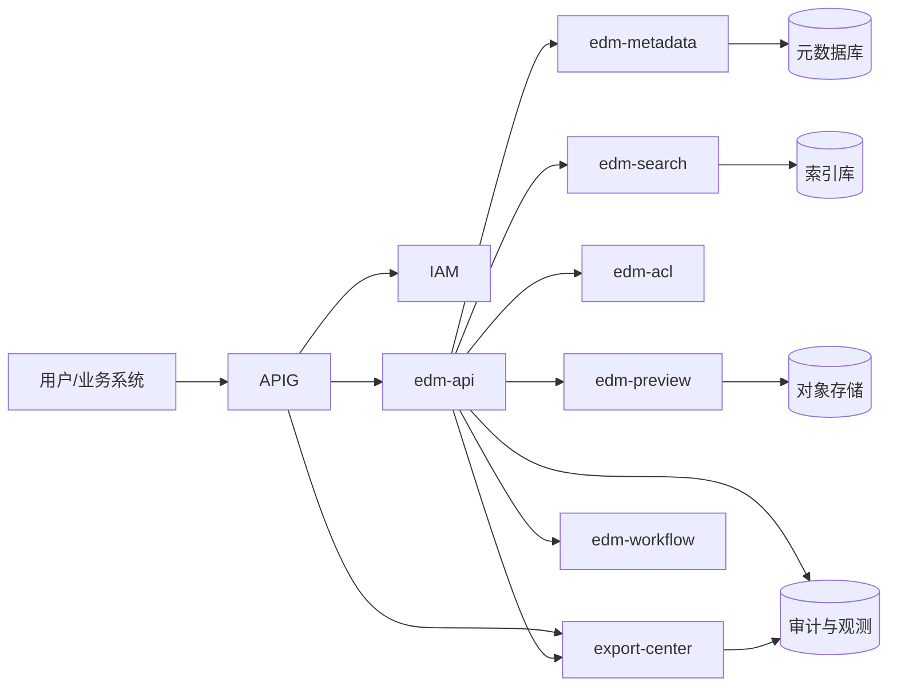

# EDM系统设计文档

## 1. 文档目标与范围

本文面向 YEDS 的企业文档管理系统（EDM，Enterprise Document Management）定义目标架构与实施路径。

目标：

- 建立企业级文档存储、检索、协同、归档与审计能力。
- 与 `apig`、`iam`、`bids`、`export-center` 完成平台化集成。
- 支持后续智能检索、内容治理与合规审计扩展。

## 2. 设计范围

- 文档全生命周期：上传、版本、预览、归档、销毁。
- 文档治理：权限、分享、水印、审计、密级。
- 平台集成：IAM 身份、APIG 接入、平台导出中心对接。

## 3. 目标架构



## 4. 核心模块

- `edm-api`：统一接口聚合层、鉴权上下文透传、错误码与幂等处理。
- `edm-metadata`：文档/目录/版本/标签/生命周期管理。
- `edm-acl`：资源授权、分享链接、下载策略、审批联动。
- `edm-search`：全文索引、条件检索、结果高亮。
- `edm-preview`：预览转换、缩略图、缓存。
- `edm-workflow`：归档审批、敏感下载审批。

## 5. 与平台导出中心关系

- EDM 不自建大文件导出执行链路。
- EDM 负责导出范围与权限校验、导出结果元数据回写。
- `export-center` 负责导出任务执行、文件生成、下载分发与任务审计。

## 6. 数据模型

```text
edm_space
edm_folder
edm_document
edm_document_version
edm_document_blob
edm_acl_policy
edm_acl_binding
edm_share_link
edm_tag
edm_document_tag
edm_audit_log
```

## 7. 接口草案

```text
POST /api/edm/spaces
POST /api/edm/folders
POST /api/edm/documents/upload
GET  /api/edm/documents/{docId}
POST /api/edm/documents/{docId}/versions
GET  /api/edm/documents/{docId}/preview
POST /api/edm/documents/{docId}/archive

POST /api/edm/acl/grant
POST /api/edm/acl/revoke
POST /api/edm/share-links

POST /api/edm/search
GET  /api/edm/audit/logs

POST /api/edm/export/jobs
GET  /api/edm/export/jobs/{jobId}
GET  /api/edm/export/jobs/{jobId}/download
```

## 8. 分阶段实施

- 阶段1：文档存管查控审 MVP + 对接 IAM/APIG。
- 阶段2：版本治理、外链策略、审批流、全文检索增强。
- 阶段3：OCR、语义检索、智能打标、合规自动化治理。

## 9. 设计引用

- `docs/Yeswater企业数字化系统规划.md`
- `export-center/docs/导出中心系统设计文档.md`
