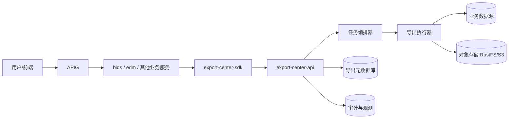
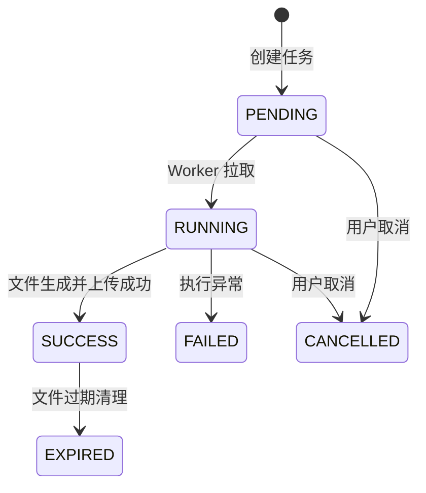

# 平台级导出中心系统设计文档

## 1. 文档目标

本文定义 YEDS 平台级导出中心（以下简称 `export-center`）的建设方案，用于统一承接各业务域的大数据导出能力，避免重复建设导出任务管理、文件生成与分发链路。

目标：

- 为 `bids`、`edm` 及后续业务组件提供统一导出能力。
- 统一异步任务、文件落盘、下载分发、审计与治理策略。
- 保持业务域内“取数与权限”边界，导出中心不侵入业务语义。

## 2. 设计原则

- **边界清晰**：业务服务负责数据准备与授权；导出中心负责导出执行与文件交付。
- **任务驱动**：统一异步任务状态机，支持可观测、可重试、可取消。
- **存储解耦**：导出文件统一落对象存储，下载基于预签名 URL。
- **安全优先**：内外调用分层鉴权，下载策略可控且全链路审计。
- **可扩展**：支持 CSV/XLSX/ZIP/PDF 等格式与多业务接入。

## 3. 总体架构



## 4. 模块设计

## 4.1 对外契约层

- `export-center-api`：REST 接口（创建任务、查询任务、取消任务、下载地址）。
- `export-center-sdk`：供业务服务调用，封装鉴权、重试、错误码映射。

## 4.2 核心执行层

- `任务编排器`：维护状态机、并发控制、租户/用户限流。
- `导出执行器`：分页/流式读取，按模板写文件，分片打包。
- `存储网关`：上传对象存储、生成预签名 URL、清理过期文件。

## 4.3 治理与支撑层

- `元数据仓储`：任务、文件、来源、耗时、失败原因。
- `审计中心`：记录任务生命周期与下载行为，支持合规追溯。
- `策略中心`：文件有效期、行数上限、格式白名单、敏感数据规则。

## 5. 业务域接入边界

## 5.1 业务域职责（bids / edm）

- 校验业务权限与参数合法性。
- 生成导出请求（包括 SQL 或数据查询描述、列定义、脱敏规则）。
- 记录业务侧审计（谁发起了导出请求）。

## 5.2 导出中心职责

- 执行导出任务（同步小文件/异步大文件）。
- 维护进度、失败重试、任务取消。
- 生成并管理导出文件下载链接。
- 提供统一任务查询与下载审计能力。

## 6. 数据模型

```text
exp_job                 导出任务主表
exp_job_payload         导出请求载荷（JSON）
exp_job_result          导出结果（文件路径、大小、行数）
exp_job_event           状态流转与错误事件
exp_download_log        下载日志
exp_policy              导出策略配置
```

`exp_job` 建议字段：

- `job_id`、`source_system`、`source_module`、`requester`
- `status`（PENDING/RUNNING/SUCCESS/FAILED/CANCELLED/EXPIRED）
- `file_format`、`estimated_rows`、`actual_rows`
- `created_at`、`started_at`、`finished_at`

## 7. 接口设计（草案）

```text
POST /api/export-center/v1/jobs
GET  /api/export-center/v1/jobs/{jobId}
POST /api/export-center/v1/jobs/{jobId}/cancel
GET  /api/export-center/v1/jobs/{jobId}/download-url
GET  /api/export-center/v1/jobs?requester=&limit=
```

## 8. 任务流程



## 9. 与现有系统集成

## 9.1 与 BIDS 集成

- `bids-exec` 保持对外导出 API，不直接写文件。
- `bids-exec` 通过 `export-center-sdk` 创建/查询导出任务。
- `bids` 保持 SQL 渲染、参数白名单与模型权限判定。

## 9.2 与 EDM 集成

- EDM 的“文档批量导出/审计导出/归档包导出”统一走导出中心。
- EDM 将导出结果回写文档空间元数据，形成文档闭环。

## 10. 安全与合规

- 业务服务到导出中心使用内部签名令牌。
- 下载链接默认短时有效（例如 15 分钟）并支持单次下载策略。
- 敏感导出支持审批标签，未审批任务禁止执行。
- 任务与下载日志保留不少于 180 天（可配置）。

## 11. 实施路线

## 阶段一：先接入 BIDS

- 抽离 `bids-export` 为 `export-center`（代码迁移 + 契约稳定）。
- 保持 BIDS 外部接口不变，仅替换内部调用目标。

## 阶段二：接入 EDM

- 将 EDM 的批量导出与审计导出能力接入导出中心。
- 打通“导出后归档到 EDM 空间”的回写链路。

## 阶段三：平台化治理

- 统一策略配置中心（格式、上限、保留期、审批规则）。
- 建立跨业务导出看板与告警（失败率、耗时、下载异常）。

## 12. 风险与应对

- **跨域耦合风险**：通过 SDK + 契约版本化控制变更面。
- **性能瓶颈风险**：采用任务队列、分片导出、水平扩容 Worker。
- **权限绕过风险**：业务侧先鉴权，导出中心只接受内部可信请求。
- **存储成本风险**：分级保留策略 + 自动过期清理。

## 13. 结论

YEDS 建议将导出能力抽取为平台级 `export-center`，形成“业务域负责语义，平台负责执行”的分工。该方案可在不破坏业务边界的前提下，统一导出治理能力并显著降低重复建设成本。
