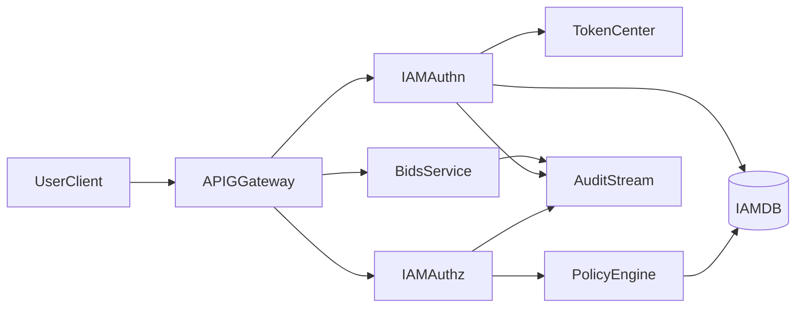

# YEDS IAM 系统实施文档

## 1. 文档目标

本文用于指导 YEDS 统一身份认证服务（IAM）的工程落地，明确实施范围、交付件、分期任务、集成方式、验收标准与风险控制策略，确保 IAM 能按“先可用、再增强、后治理”的节奏稳定上线。

## 2. 实施范围

本实施文档覆盖以下能力建设：

- 统一认证：登录、令牌签发、刷新、吊销、会话管理。
- 统一授权：RBAC 基础授权与策略判定接口。
- 身份治理：用户、角色、权限、应用身份、凭证轮换。
- 网关集成：与 `apig` 的令牌校验和鉴权协同。
- 业务集成：与 `bids` 的身份上下文透传和权限落地。
- 审计闭环：认证/鉴权/敏感操作审计日志归集。

## 3. 实施原则

- 最小权限原则：默认拒绝，按需授权。
- 平滑迁移原则：采用灰度与双写对账，避免一次性切换。
- 低耦合集成原则：`iam` 输出标准接口，`apig`/`bids` 按契约接入。
- 高可用原则：关键链路可降级、可回滚、可观测。

## 4. 总体实施架构



## 5. 分阶段实施计划

## 5.1 阶段一：MVP（先可用）

### 目标

- 打通“登录 -> 发 Token -> 网关校验 -> 业务访问 -> 审计记录”主链路。

### 核心任务

1. 建立 IAM 基础数据模型：用户、角色、权限、用户角色关系。
2. 实现认证接口：`/auth/login`、`/auth/refresh`、`/auth/logout`、`/auth/jwks`。
3. 实现授权接口：`/authorize/check`、`/authorize/batch-check`。
4. 接入 `apig`：支持 JWK 拉取、本地缓存、公钥轮询。
5. 接入 `bids`：透传身份上下文（用户 ID、角色、租户）。
6. 落审计日志：登录成功/失败、鉴权允许/拒绝、关键操作记录。

### 交付件

- IAM 服务可运行版本（容器镜像或本地进程部署脚本）。
- 接口文档（OpenAPI 或 Markdown）。
- 认证与鉴权联调记录（`apig` + `bids`）。

### 验收标准

- 可登录并签发有效 JWT。
- 网关可完成 Token 校验与基础权限拦截。
- 鉴权结果与角色配置一致，拒绝场景返回 403。
- 审计日志可按时间和用户检索。

## 5.2 阶段二：增强（可治理）

### 目标

- 在主链路稳定基础上，补齐安全治理和组织协同能力。

### 核心任务

1. 引入 MFA（短信/OTP 任选一种先行）。
2. 引入基础 SSO（优先 OIDC 协议）。
3. 扩展策略条件：IP 白名单、时间窗口、环境标签。
4. 增加应用身份管理与密钥轮换接口。
5. 建立权限变更审批与生效审计链路。

### 交付件

- MFA 与 SSO 接入文档。
- 应用凭证管理与轮换操作手册。
- 权限审批流程说明与审计示例。

### 验收标准

- 高风险账号可开启 MFA 并生效。
- 外部身份源可通过 OIDC 完成登录。
- 凭证轮换不影响在线业务连续性。
- 权限变更有审批记录和操作追踪。

## 5.3 阶段三：治理（可规模化）

### 目标

- 面向多系统与多租户场景，建设自动化与精细化权限治理体系。

### 核心任务

1. 引入 ABAC 扩展，支持资源属性与上下文判定。
2. 引入风险识别策略（异常登录、越权访问、高频拒绝）。
3. 支持跨系统联邦身份与多租户隔离策略。
4. 建立权限巡检机制（过权、僵尸账号、长期未使用凭证）。

### 交付件

- ABAC 策略模板库。
- 风险规则与告警配置说明。
- 多租户接入规范与隔离清单。

### 验收标准

- 可实现“角色 + 属性”联合授权判定。
- 风险行为可触发告警并可追溯。
- 多租户资源访问边界清晰且可验证。

## 6. 数据模型实施说明

建议的核心表（逻辑模型）：

- `iam_user`
- `iam_group`
- `iam_role`
- `iam_permission`
- `iam_user_role`
- `iam_role_permission`
- `iam_policy`
- `iam_client`
- `iam_token_session`
- `iam_audit_log`

建模建议：

- 所有主实体设置 `id`、`gmt_create`、`gmt_modified`。
- 对用户唯一标识、客户端标识设置唯一索引。
- 关系表建立联合索引，保障鉴权查询性能。
- 审计表按时间分区或冷热分层存储。

## 7. 接口实施清单

## 7.1 认证接口

```text
POST /api/iam/auth/login
POST /api/iam/auth/refresh
POST /api/iam/auth/logout
GET  /api/iam/auth/jwks
```

## 7.2 授权接口

```text
POST /api/iam/authorize/check
POST /api/iam/authorize/batch-check
GET  /api/iam/authorize/user-permissions
```

## 7.3 管理接口

```text
POST /api/iam/users
POST /api/iam/roles
POST /api/iam/roles/{roleId}/permissions
POST /api/iam/policies
POST /api/iam/clients
POST /api/iam/clients/{clientId}/rotate-secret
```

## 8. 集成实施方案

## 8.1 与 APIG 集成

- 网关启动时加载 IAM JWK，定时轮询更新。
- 鉴权请求优先本地缓存命中，未命中再调用 IAM。
- 统一认证与鉴权失败错误码，便于前端与调用方处理。

## 8.2 与 BIDS 集成

- 业务请求头透传标准身份上下文（用户、角色、租户）。
- BIDS 保留业务资源定义，统一调用 IAM 判定策略。
- 敏感操作统一输出业务审计事件并关联身份信息。

## 9. 部署与运行

部署建议：

- IAM 与 APIG 同机房或低延迟网络部署。
- 数据库采用主从或高可用方案，避免单点。
- Redis 用于令牌黑名单、授权缓存和会话态加速。
- 审计日志异步写入，避免阻塞主交易链路。

运行指标建议：

- 登录成功率、登录失败率。
- 鉴权拒绝率、鉴权接口 P95 延时。
- JWK 拉取成功率、缓存命中率。
- 审计落库延迟与丢失率。

## 10. 任务分解建议（工程执行）

### Sprint 1（2 周）

- 建基础库表与实体模型。
- 实现认证接口和 JWT 机制。
- 对接 APIG JWK 校验。

### Sprint 2（2 周）

- 实现授权接口和角色权限模型。
- 打通 BIDS 身份透传与鉴权调用。
- 上线基础审计日志。

### Sprint 3（2 周）

- 引入 MFA 和基础 SSO（可选灰度）。
- 增加密钥轮换与策略条件化。
- 完成运维与故障处理手册。

## 11. 风险与应急

主要风险：

- 鉴权链路额外延时导致网关吞吐下降。
- 权限迁移期间出现误拒绝或误放行。
- 密钥轮换窗口处理不当导致大面积认证失败。

应急策略：

- 鉴权服务异常时启用网关短期缓存兜底。
- 权限切换采用灰度发布和按应用回滚开关。
- 密钥采用双 Key 并行期，支持快速回退旧 Key。

## 12. 验收与上线门禁

上线门禁建议：

- 必须通过联调用例：登录、刷新、鉴权允许、鉴权拒绝、吊销生效。
- 必须通过安全检查：弱口令、过权账户、未授权接口访问。
- 必须通过性能基线：峰值流量下鉴权延迟在目标阈值内。
- 必须通过可观测检查：关键指标与日志均可查询和告警。

## 13. 参考输入来源

本实施文档基于以下既有设计输入整理：

- `iam/docs/iam系统设计文档.md`

