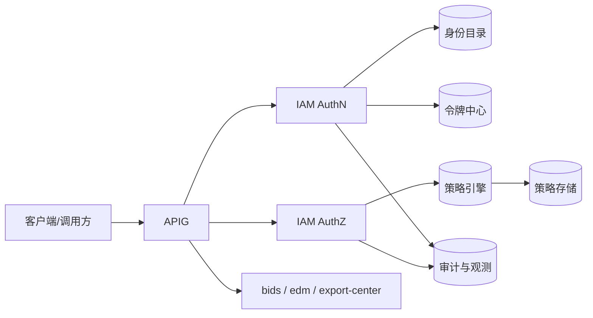

# IAM系统设计文档

## 1. 文档目标

本文定义 YEDS 统一身份认证与授权系统（IAM）的目标架构与落地边界，支撑平台内组件（`apig`、`bids`、`edm`、`export-center`）统一身份与权限治理。

## 2. 设计定位

- 统一身份源：用户、组织、角色、应用、机器身份。
- 统一认证入口：登录、令牌签发与校验、会话管理。
- 统一授权能力：RBAC 为主，支持向 ABAC 扩展。
- 统一审计能力：认证与鉴权行为可追溯、可检索、可告警。

## 3. 架构概览



## 4. 核心能力

### 4.1 认证

- 登录、刷新、退出、JWK 拉取。
- 支持短期令牌与密钥轮换。

### 4.2 授权

- 权限判定：`Subject + Resource + Action`。
- 基础 RBAC：`用户 -> 角色 -> 权限点 -> 资源`。
- 增强 ABAC：支持时间窗、IP、环境等条件策略。

### 4.3 身份与凭证管理

- 用户、组织、角色生命周期管理。
- 应用凭证管理与 Secret 轮换。

### 4.4 审计

- 记录认证成功/失败、鉴权允许/拒绝、敏感变更操作。
- 支持按用户、资源、时间、客户端维度检索。

## 5. 与平台组件边界

- 与 `apig`：APIG 负责接入与快速拦截，IAM 负责身份与策略判定。
- 与 `bids`：BIDS 不自建登录，消费 IAM 身份上下文。
- 与 `edm`：EDM 权限基线与外链风控由 IAM 支撑。
- 与 `export-center`：导出任务发起者身份、下载鉴权策略由 IAM 提供基线。

## 6. 接口草案

```text
POST /api/iam/auth/login
POST /api/iam/auth/refresh
POST /api/iam/auth/logout
GET  /api/iam/auth/jwks

POST /api/iam/authorize/check
POST /api/iam/authorize/batch-check
GET  /api/iam/authorize/user-permissions

POST /api/iam/users
POST /api/iam/roles
POST /api/iam/roles/{roleId}/permissions
POST /api/iam/policies
POST /api/iam/clients
POST /api/iam/clients/{clientId}/rotate-secret
```

## 7. 数据模型

```text
iam_user
iam_group
iam_role
iam_permission
iam_user_role
iam_role_permission
iam_policy
iam_client
iam_token_session
iam_audit_log
```

## 8. 分阶段实施

- 阶段1（MVP）：统一登录、JWT、网关校验、基础审计。
- 阶段2（增强）：MFA、SSO、条件策略、凭证轮换治理。
- 阶段3（治理）：ABAC 精细化、风险识别、多租户与联邦扩展。

## 9. 设计引用

- `docs/Yeswater企业数字化系统规划.md`
- `iam/docs/iam系统实施文档.md`
